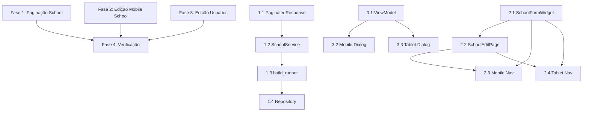

# Plano de Implementação Detalhado - TODOs do Sistema EMS

Este documento detalha a ordem de execução, dependências e arquivos específicos para implementação dos TODOs identificados nos módulos School e User.

---

## FASE 1: Padronização de Paginação no Módulo School

**Objetivo**: Fazer o módulo School usar paginação real do servidor, seguindo o padrão já implementado em User.

**Complexidade**: Média | **Prioridade**: Alta | **Dependências**: Nenhuma

### Tarefa 1.1: Criar PaginatedResponse em school_shared

**Arquivo a criar**:
```
/packages/school/school_shared/lib/src/data/models/paginated_response.dart
```

**Referência**:
```
/packages/user/user_shared/lib/src/data/models/paginated_response.dart
```

**Implementação**:
```dart
class PaginatedResponse<T> {
  final List<T> data;
  final int page;
  final int limit;
  final int total;

  const PaginatedResponse({
    required this.data,
    required this.page,
    required this.limit,
    required this.total,
  });

  factory PaginatedResponse.fromJson(
    Map<String, dynamic> json,
    T Function(Object? json) fromJsonT,
  ) {
    return PaginatedResponse<T>(
      data: (json['data'] as List<dynamic>)
          .map((e) => fromJsonT(e))
          .toList(),
      page: json['page'] as int,
      limit: json['limit'] as int,
      total: json['total'] as int,
    );
  }

  Map<String, dynamic> toJson(Object? Function(T value) toJsonT) {
    return {
      'data': data.map(toJsonT).toList(),
      'page': page,
      'limit': limit,
      'total': total,
    };
  }

  PaginatedResponse<R> map<R>(R Function(T) transform) {
    return PaginatedResponse<R>(
      data: data.map(transform).toList(),
      page: page,
      limit: limit,
      total: total,
    );
  }
}
```

**Exportar em**: `/packages/school/school_shared/lib/school_shared.dart`
```dart
export 'src/data/models/paginated_response.dart';
```

---

### Tarefa 1.2: Atualizar SchoolService (Retrofit)

**Arquivo a modificar**:
```
/packages/school/school_client/lib/src/services/school_service.dart
```

**Mudanças**:

**Antes** (linha ~20):
```dart
@GET('/schools')
Future<List<SchoolDetailsModel>> getAll({
  @Query('limit') int? limit,
  @Query('offset') int? offset,
  @Query('search') String? search,
  @Query('status') String? status,
  @Query('city') String? city,
  @Query('district') String? district,
});
```

**Depois**:
```dart
@GET('/schools')
Future<PaginatedResponse<SchoolDetailsModel>> getAll({
  @Query('limit') int? limit,
  @Query('offset') int? offset,
  @Query('search') String? search,
  @Query('status') String? status,
  @Query('city') String? city,
  @Query('district') String? district,
});
```

**Antes** (linha ~30):
```dart
@GET('/schools/deleted')
Future<List<SchoolDetailsModel>> getDeleted({
  @Query('limit') int? limit,
  @Query('offset') int? offset,
  @Query('search') String? search,
  @Query('city') String? city,
  @Query('district') String? district,
});
```

**Depois**:
```dart
@GET('/schools/deleted')
Future<PaginatedResponse<SchoolDetailsModel>> getDeleted({
  @Query('limit') int? limit,
  @Query('offset') int? offset,
  @Query('search') String? search,
  @Query('city') String? city,
  @Query('district') String? district,
});
```

**Importar**:
```dart
import 'package:school_shared/school_shared.dart' show PaginatedResponse;
```

---

### Tarefa 1.3: Executar build_runner

**Comando**:
```bash
cd packages/school/school_client
dart run build_runner build --delete-conflicting-outputs
```

**Objetivo**: Regenerar `school_service.g.dart` com os novos tipos de retorno.

---

### Tarefa 1.4: Atualizar SchoolRepositoryClient

**Arquivo a modificar**:
```
/packages/school/school_client/lib/src/repositories/school_repository_client.dart
```

**Mudanças em getAll()** (linhas ~40-75):

**Antes** (linhas 66-71 - TODO existente):
```dart
return PaginatedResult.fromOffset(
  items: items,
  total: items.length, // Temporarily: no total from server
  offset: offset ?? 0,
  limit: limit ?? 50,
);
```

**Depois**:
```dart
final response = await _service.getAll(
  limit: limit,
  offset: offset,
  search: search,
  status: status?.name,
  city: city,
  district: district,
);

final items = response.data.map((model) => model.toDomain()).toList();

// Converter page para offset-based result
final page = (offset ?? 0) ~/ (limit ?? 50) + 1;
return PaginatedResult<SchoolDetails>(
  items: items,
  total: response.total,
  page: page,
  limit: response.limit,
);
```

**Mudanças em getDeleted()** (similar):
```dart
final response = await _service.getDeleted(
  limit: limit,
  offset: offset,
  search: search,
  city: city,
  district: district,
);

final items = response.data.map((model) => model.toDomain()).toList();

final page = (offset ?? 0) ~/ (limit ?? 50) + 1;
return PaginatedResult<SchoolDetails>(
  items: items,
  total: response.total,
  page: page,
  limit: response.limit,
);
```

**Remover**: Comentário TODO nas linhas 66-71

---

## FASE 2: Edição de Schools em Dispositivos Móveis

**Objetivo**: Permitir editar schools em mobile/tablet, evitando duplicação de código.

**Complexidade**: Alta | **Prioridade**: Média | **Dependências**: Nenhuma (pode ser feita em paralelo com Fase 1)

### Tarefa 2.1: Extrair SchoolFormWidget

**Arquivo a criar**:
```
/packages/school/school_ui/lib/ui/widgets/forms/school_form_widget.dart
```

**Referência**:
```
/packages/school/school_ui/lib/ui/widgets/components/desktop/desktop_edit_item_widget.dart
```

**Implementação**:
```dart
import 'package:flutter/material.dart';
import 'package:zard_form/zard_form.dart';
import 'package:school_shared/school_shared.dart';
import 'package:design_system_ui/design_system_ui.dart';
import 'package:localizations_ui/localizations_ui.dart';

class SchoolFormWidget extends StatefulWidget {
  final SchoolDetails? initialData;
  final void Function(Map<String, dynamic> data) onSubmit;
  final VoidCallback? onCancel;
  final bool showCancelButton;

  const SchoolFormWidget({
    super.key,
    this.initialData,
    required this.onSubmit,
    this.onCancel,
    this.showCancelButton = true,
  });

  @override
  State<SchoolFormWidget> createState() => _SchoolFormWidgetState();
}

class _SchoolFormWidgetState extends State<SchoolFormWidget> {
  bool _isFormValid = false;
  bool _hasChanges = false;
  Map<String, dynamic> _formData = {};

  @override
  Widget build(BuildContext context) {
    final l10n = AppLocalizations.of(context);

    return ZForm<Map<String, dynamic>>(
      validationMode: ValidationMode.onChange,
      resolver: zardResolver(SchoolDetailsValidator.schema),
      onValid: (data) {
        widget.onSubmit(data);
      },
      builder: (form) {
        _isFormValid = form.isValid;
        _hasChanges = form.isDirty;
        _formData = form.data;

        return Column(
          mainAxisSize: MainAxisSize.min,
          crossAxisAlignment: CrossAxisAlignment.stretch,
          children: [
            // Nome da escola
            ZFormField<String>(
              form: form,
              name: schoolNameByField,
              initialValue: widget.initialData?.name ?? '',
              builder: (field) => TextField(
                controller: field.controller,
                decoration: InputDecoration(
                  labelText: l10n.schoolName,
                  errorText: field.error,
                  border: const OutlineInputBorder(),
                ),
                onChanged: field.onChange,
              ),
            ),
            SizedBox(height: DSSpacing.small),

            // Email
            ZFormField<String>(
              form: form,
              name: schoolEmailByField,
              initialValue: widget.initialData?.email ?? '',
              builder: (field) => TextField(
                controller: field.controller,
                decoration: InputDecoration(
                  labelText: l10n.email,
                  errorText: field.error,
                  border: const OutlineInputBorder(),
                ),
                keyboardType: TextInputType.emailAddress,
                onChanged: field.onChange,
              ),
            ),
            SizedBox(height: DSSpacing.small),

            // Endereço
            ZFormField<String>(
              form: form,
              name: schoolAddressByField,
              initialValue: widget.initialData?.address ?? '',
              builder: (field) => TextField(
                controller: field.controller,
                decoration: InputDecoration(
                  labelText: l10n.address,
                  errorText: field.error,
                  border: const OutlineInputBorder(),
                ),
                onChanged: field.onChange,
              ),
            ),
            SizedBox(height: DSSpacing.small),

            // Telefone
            ZFormField<String>(
              form: form,
              name: schoolPhoneByField,
              initialValue: widget.initialData?.phone ?? '',
              builder: (field) => TextField(
                controller: field.controller,
                decoration: InputDecoration(
                  labelText: l10n.phone,
                  errorText: field.error,
                  border: const OutlineInputBorder(),
                ),
                keyboardType: TextInputType.phone,
                onChanged: field.onChange,
              ),
            ),
            SizedBox(height: DSSpacing.small),

            // Código
            ZFormField<String>(
              form: form,
              name: schoolCodeByField,
              initialValue: widget.initialData?.code ?? '',
              builder: (field) => TextField(
                controller: field.controller,
                decoration: InputDecoration(
                  labelText: l10n.schoolCode,
                  errorText: field.error,
                  border: const OutlineInputBorder(),
                ),
                onChanged: field.onChange,
              ),
            ),
            SizedBox(height: DSSpacing.medium),

            // Botões
            Row(
              mainAxisAlignment: MainAxisAlignment.end,
              children: [
                if (widget.showCancelButton) ...[
                  TextButton(
                    onPressed: widget.onCancel,
                    child: Text(l10n.cancel),
                  ),
                  SizedBox(width: DSSpacing.small),
                ],
                ElevatedButton(
                  onPressed: _isFormValid && _hasChanges
                      ? () => form.submit()
                      : null,
                  child: Text(l10n.save),
                ),
              ],
            ),
          ],
        );
      },
    );
  }
}
```

**Exportar em**: `/packages/school/school_ui/lib/school_ui.dart`
```dart
export 'ui/widgets/forms/school_form_widget.dart';
```

---

### Tarefa 2.2: Criar SchoolEditPage

**Arquivo a criar**:
```
/packages/school/school_ui/lib/ui/pages/school_edit_page.dart
```

**Implementação**:
```dart
import 'package:flutter/material.dart';
import 'package:provider/provider.dart';
import 'package:school_shared/school_shared.dart';
import 'package:school_ui/ui/view_models/school_view_model.dart';
import 'package:school_ui/ui/widgets/forms/school_form_widget.dart';
import 'package:design_system_ui/design_system_ui.dart';
import 'package:localizations_ui/localizations_ui.dart';

class SchoolEditPage extends StatelessWidget {
  final SchoolDetails school;

  const SchoolEditPage({
    super.key,
    required this.school,
  });

  @override
  Widget build(BuildContext context) {
    final l10n = AppLocalizations.of(context);
    final viewModel = context.watch<SchoolViewModel>();

    return Scaffold(
      appBar: AppBar(
        title: Text(l10n.editSchool),
      ),
      body: SingleChildScrollView(
        padding: DSPaddings.medium,
        child: SchoolFormWidget(
          initialData: school,
          showCancelButton: false,
          onSubmit: (data) async {
            final updated = school.copyWith(
              name: data[schoolNameByField] as String,
              email: data[schoolEmailByField] as String,
              address: data[schoolAddressByField] as String,
              phone: data[schoolPhoneByField] as String,
              code: data[schoolCodeByField] as String,
            );

            final result = await viewModel.updateEntity(updated);

            if (!context.mounted) return;

            result.when(
              success: (_) {
                DSAlert.success(
                  context,
                  message: l10n.schoolUpdatedSuccessfully,
                );
                Navigator.of(context).pop(true);
              },
              failure: (error) {
                DSAlert.error(
                  context,
                  message: error.message,
                );
              },
            );
          },
        ),
      ),
    );
  }
}
```

**Exportar em**: `/packages/school/school_ui/lib/school_ui.dart`
```dart
export 'ui/pages/school_edit_page.dart';
```

---

### Tarefa 2.3: Implementar navegação em MobileWidget

**Arquivo a modificar**:
```
/packages/school/school_ui/lib/ui/widgets/components/mobile/mobile_widget.dart
```

**Adicionar método de navegação** (após linha ~50):
```dart
Future<void> _navigateToEdit(BuildContext context, SchoolDetails school) async {
  final result = await Navigator.of(context).push<bool>(
    MaterialPageRoute(
      builder: (context) => SchoolEditPage(school: school),
    ),
  );

  if (result == true && context.mounted) {
    // Recarregar lista após edição
    context.read<SchoolViewModel>().refreshCommand.execute();
  }
}
```

**Modificar onEdit callback** no SchoolCard (linha ~140):
```dart
SchoolCard(
  school: school,
  onTap: () => _showDetails(context, school),
  onEdit: () => _navigateToEdit(context, school), // ATUALIZAR
  onDelete: () => _confirmDelete(context, school),
  onRestore: showDeleted ? () => _confirmRestore(context, school) : null,
),
```

**Adicionar import**:
```dart
import 'package:school_ui/ui/pages/school_edit_page.dart';
```

---

### Tarefa 2.4: Implementar navegação em TabletWidget

**Arquivo a modificar**:
```
/packages/school/school_ui/lib/ui/widgets/components/tablet/tablet_widget.dart
```

**Adicionar método de navegação** (após linha ~50):
```dart
Future<void> _navigateToEdit(BuildContext context, SchoolDetails school) async {
  final result = await Navigator.of(context).push<bool>(
    MaterialPageRoute(
      builder: (context) => SchoolEditPage(school: school),
    ),
  );

  if (result == true && context.mounted) {
    context.read<SchoolViewModel>().refreshCommand.execute();
  }
}
```

**Modificar onEdit callback** no SchoolGridCard (linha ~160):
```dart
SchoolGridCard(
  school: school,
  onTap: () => _showDetails(context, school),
  onEdit: () => _navigateToEdit(context, school), // ATUALIZAR
  onDelete: () => _confirmDelete(context, school),
  onRestore: showDeleted ? () => _confirmRestore(context, school) : null,
),
```

**Adicionar import**:
```dart
import 'package:school_ui/ui/pages/school_edit_page.dart';
```

---

### Tarefa 2.5: Refatorar DesktopEditItemWidget (opcional)

**Arquivo a modificar**:
```
/packages/school/school_ui/lib/ui/widgets/components/desktop/desktop_edit_item_widget.dart
```

**Substituir implementação** para usar SchoolFormWidget:
```dart
return Padding(
  padding: DSPaddings.medium,
  child: SchoolFormWidget(
    initialData: widget.school,
    onSubmit: (data) async {
      final updated = widget.school.copyWith(
        name: data[schoolNameByField] as String,
        email: data[schoolEmailByField] as String,
        address: data[schoolAddressByField] as String,
        phone: data[schoolPhoneByField] as String,
        code: data[schoolCodeByField] as String,
      );

      final result = await viewModel.updateEntity(updated);

      if (!context.mounted) return;

      result.when(
        success: (_) {
          DSAlert.success(context, message: l10n.schoolUpdatedSuccessfully);
        },
        failure: (error) {
          DSAlert.error(context, message: error.message);
        },
      );
    },
    onCancel: null,
    showCancelButton: false,
  ),
);
```

---

## FASE 3: Gerenciamento de Usuários - Diálogo de Edição

**Objetivo**: Implementar diálogo de edição de usuários no painel administrativo.

**Complexidade**: Média | **Prioridade**: Média | **Dependências**: Nenhuma

### Tarefa 3.1: Verificar métodos do ManageUsersViewModel

**Arquivo a verificar**:
```
/packages/user/user_ui/lib/view_models/manage_users_view_model.dart
```

**Verificar existência dos métodos**:
- `updateUserRole(userId, newRole)` - linha ~140
- `toggleUserStatus(userId)` - linha ~160
- `Future<Result<User>> updateUserBasicInfo(userId, name, phone)` - **CRIAR SE NÃO EXISTIR**

**Se não existir updateUserBasicInfo, adicionar**:
```dart
Future<Result<void>> updateUserBasicInfo(
  String userId,
  String name,
  String phone,
) async {
  setState(ViewState.loading);

  try {
    // Assumindo que existe um método no repository
    final result = await _userRepository.updateBasicInfo(
      userId: userId,
      name: name,
      phone: phone,
    );

    return result.when(
      success: (_) {
        loadUsers(refresh: true);
        setState(ViewState.success);
        return const Success(null);
      },
      failure: (error) {
        setState(ViewState.error);
        return Failure(error);
      },
    );
  } catch (e) {
    setState(ViewState.error);
    return Failure(ApiError(message: e.toString()));
  }
}
```

---

### Tarefa 3.2: Implementar _showEditDialog em MobileWidget

**Arquivo a modificar**:
```
/packages/user/user_ui/lib/pages/manage_users_page.dart
```

**Localizar MobileWidget** (linha ~200) e adicionar método após _showCreateDialog:

```dart
void _showEditDialog(BuildContext context, User user) {
  final formKey = GlobalKey<FormState>();
  final nameController = TextEditingController(text: user.name);
  final phoneController = TextEditingController(text: user.phone ?? '');
  UserRole selectedRole = user.role;
  bool isActive = user.isActive;

  showDialog(
    context: context,
    builder: (dialogContext) => StatefulBuilder(
      builder: (context, setDialogState) {
        final l10n = AppLocalizations.of(context);
        final viewModel = Provider.of<ManageUsersViewModel>(
          context,
          listen: false,
        );

        return AlertDialog(
          title: Text(l10n.editUser),
          content: SingleChildScrollView(
            child: Form(
              key: formKey,
              child: Column(
                mainAxisSize: MainAxisSize.min,
                children: [
                  // Nome
                  TextFormField(
                    controller: nameController,
                    decoration: InputDecoration(
                      labelText: l10n.name,
                      border: const OutlineInputBorder(),
                    ),
                    validator: (value) {
                      if (value == null || value.trim().length < 2) {
                        return l10n.nameMustBeAtLeast2Characters;
                      }
                      return null;
                    },
                  ),
                  SizedBox(height: DSSpacing.small),

                  // Telefone
                  TextFormField(
                    controller: phoneController,
                    decoration: InputDecoration(
                      labelText: l10n.phone,
                      border: const OutlineInputBorder(),
                    ),
                    keyboardType: TextInputType.phone,
                    validator: (value) {
                      if (value != null &&
                          value.isNotEmpty &&
                          value.length < 10) {
                        return l10n.phoneInvalid;
                      }
                      return null;
                    },
                  ),
                  SizedBox(height: DSSpacing.small),

                  // Role (apenas para admins)
                  if (viewModel.currentUserRole == UserRole.owner)
                    DropdownButtonFormField<UserRole>(
                      value: selectedRole,
                      decoration: InputDecoration(
                        labelText: l10n.role,
                        border: const OutlineInputBorder(),
                      ),
                      items: UserRole.values.map((role) {
                        return DropdownMenuItem(
                          value: role,
                          child: Text(role.displayName),
                        );
                      }).toList(),
                      onChanged: (newRole) {
                        if (newRole != null) {
                          setDialogState(() {
                            selectedRole = newRole;
                          });
                        }
                      },
                    ),
                  SizedBox(height: DSSpacing.small),

                  // Status Ativo
                  SwitchListTile(
                    title: Text(l10n.activeStatus),
                    value: isActive,
                    onChanged: (value) {
                      setDialogState(() {
                        isActive = value;
                      });
                    },
                  ),
                ],
              ),
            ),
          ),
          actions: [
            TextButton(
              onPressed: () => Navigator.of(dialogContext).pop(),
              child: Text(l10n.cancel),
            ),
            ElevatedButton(
              onPressed: () async {
                if (formKey.currentState!.validate()) {
                  // Atualizar informações básicas
                  if (nameController.text != user.name ||
                      phoneController.text != user.phone) {
                    await viewModel.updateUserBasicInfo(
                      user.id,
                      nameController.text.trim(),
                      phoneController.text.trim(),
                    );
                  }

                  // Atualizar role se mudou
                  if (selectedRole != user.role &&
                      viewModel.currentUserRole == UserRole.owner) {
                    await viewModel.updateUserRole(user.id, selectedRole);
                  }

                  // Atualizar status se mudou
                  if (isActive != user.isActive) {
                    await viewModel.toggleUserStatus(user.id);
                  }

                  if (dialogContext.mounted) {
                    Navigator.of(dialogContext).pop();
                  }

                  DSAlert.success(
                    context,
                    message: l10n.userUpdatedSuccessfully,
                  );
                }
              },
              child: Text(l10n.save),
            ),
          ],
        );
      },
    ),
  );
}
```

**Conectar ao botão de edição** (procurar por IconButton com Icons.edit):
```dart
IconButton(
  icon: const Icon(Icons.edit),
  onPressed: () => _showEditDialog(context, user), // ATUALIZAR
),
```

---

### Tarefa 3.3: Implementar _showEditDialog em TabletWidget

**Mesmo arquivo**: `/packages/user/user_ui/lib/pages/manage_users_page.dart`

**Localizar TabletWidget** (linha ~400) e adicionar o mesmo método `_showEditDialog` (código idêntico ao da Tarefa 3.2).

**Conectar ao botão de edição** no TabletWidget:
```dart
IconButton(
  icon: const Icon(Icons.edit),
  onPressed: () => _showEditDialog(context, user), // ATUALIZAR
),
```

---

## FASE 4: Verificação e Qualidade

**Objetivo**: Garantir que todas as mudanças estejam corretas e funcionais.

**Complexidade**: Baixa | **Prioridade**: Alta | **Dependências**: Fases 1, 2 e 3 completas

### Tarefa 4.1: Análise Estática

**Comandos**:
```bash
# School packages
cd packages/school/school_shared && dart analyze
cd ../school_client && dart analyze
cd ../school_ui && flutter analyze

# User packages
cd ../../user/user_ui && flutter analyze
```

**Critério de sucesso**: Zero erros, warnings opcionais podem ser ignorados se justificados.

---

### Tarefa 4.2: Executar Testes Unitários

**Comandos**:
```bash
# School
cd packages/school/school_shared && dart test
cd ../school_client && dart test
cd ../school_ui && flutter test

# User
cd ../../user/user_ui && flutter test
```

**Critério de sucesso**: Todos os testes passam. Se houver falhas, corrigir antes de prosseguir.

---

### Tarefa 4.3: Teste de Integração no App EMS

**Comandos**:
```bash
cd apps/ems
flutter pub get
flutter run
```

**Checklist de verificação manual**:
- [ ] Listagem de schools exibe dados paginados corretamente
- [ ] Edição de schools funciona em mobile/tablet
- [ ] Formulário de edição valida campos corretamente
- [ ] Edição de usuários funciona no painel admin
- [ ] Mudanças de role/status de usuário são persistidas
- [ ] Não há regressões em funcionalidades existentes

---

### Tarefa 4.4: Formatação de Código

**Comando**:
```bash
dart format packages/school packages/user
```

---

## RESUMO DE DEPENDÊNCIAS



---

## ORDEM RECOMENDADA DE EXECUÇÃO

1. **Fase 1 completa** (1.1 → 1.2 → 1.3 → 1.4)
2. **Fase 2 completa** (2.1 → 2.2 → 2.3 → 2.4 → 2.5)
3. **Fase 3 completa** (3.1 → 3.2 → 3.3)
4. **Fase 4 completa** (4.1 → 4.2 → 4.3 → 4.4)

**Paralelização possível**:
- Fases 1, 2 e 3 podem ser executadas em paralelo por diferentes desenvolvedores
- Tarefa 2.5 (refatorar Desktop) é opcional e pode ser feita depois

---

## CHECKLIST FINAL

- [ ] Todas as tarefas da Fase 1 completas
- [ ] Todas as tarefas da Fase 2 completas
- [ ] Todas as tarefas da Fase 3 completas
- [ ] Análise estática sem erros
- [ ] Testes unitários passando
- [ ] Teste de integração manual realizado
- [ ] Código formatado
- [ ] Commit com mensagem descritiva
- [ ] Pull request criado (se aplicável)

---

**Estimativa total**: 6-8 horas de desenvolvimento + 2 horas de testes e verificação
