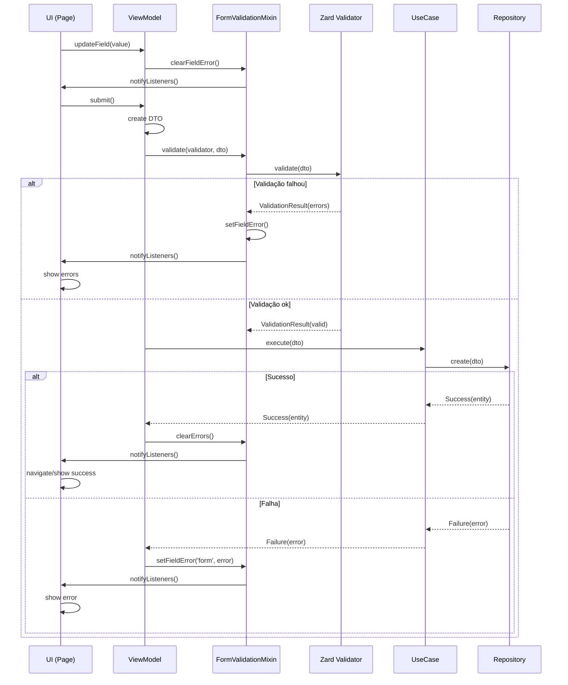

# 4. Uso de FormValidationMixin e Zard

Date: 2025-12-07  
Updated: 2026-01-11

## Status

Aceito

## Contexto

A validação de formulários é uma parte crítica de aplicações com entrada de dados do usuário. Sem um padrão claro, validações tendem a:

- **Espalhar-se pela UI**: Lógica de validação misturada com widgets, tornando-os difíceis de testar
- **Duplicar código**: Mesmas regras implementadas várias vezes em diferentes telas
- **Ser inconsistente**: Diferentes abordagens em diferentes partes do sistema
- **Dificultar manutenção**: Mudanças em regras de validação requerem alterações em múltiplos locais
- **Complicar testes**: Validações acopladas à UI são difíceis de testar isoladamente

Além disso, validações devem estar alinhadas com as regras de negócio definidas nas entidades e DTOs, criando uma camada adicional de complexidade.

### Problemas Identificados

1. **Validação imperativa**: Código verboso com múltiplos `if-else`
2. **Acoplamento**: Validação misturada com lógica de UI e negócio
3. **Falta de reusabilidade**: Mesmas validações reimplementadas
4. **Mensagens inconsistentes**: Diferentes formatos de erro em diferentes telas
5. **Testabilidade baixa**: Validações acopladas são difíceis de testar

### Requisitos

- Validações **declarativas** e **reutilizáveis**
- Separação clara entre **validação** e **lógica de negócio**
- Integração suave com **ViewModels** (MVVM pattern)
- Mensagens de erro **consistentes** e **localizáveis**
- **Fácil de testar** isoladamente
- Alinhamento com **Result Pattern** (ADR-0001)

## Decisão

Adotar o pacote **`zard`** para definição declarativa de schemas de validação e criar um **`FormValidationMixin`** no pacote `core_ui` para integrar a validação nos ViewModels.

### Componentes da Solução

#### 1. Pacote Zard

[Zard](https://pub.dev/packages/zard) é um pacote Dart para validação declarativa de dados, permitindo:
- Definição de schemas de validação compostos
- Mensagens de erro customizáveis
- Validadores built-in e customizados
- Composição de validadores complexos

#### 2. FormValidationMixin

Mixin para ViewModels que:
- Gerencia estado de erros por campo
- Integra com Zard validators
- Notifica listeners automaticamente
- Fornece API limpa para validação

#### 3. Validators no Core

Validators Zard definidos em `*_core/validators/` para:
- Validação de DTOs antes de envio
- Validação de formulários na UI
- Garantir consistência entre client e server

## Estrutura de Diretórios

### Pacote Core

```
packages/<feature>/<feature>_core/
  lib/src/
    validators/
      <entity>_create_validator.dart    # Validação para criação
      <entity>_update_validator.dart    # Validação para atualização
      <entity>_validator.dart           # Validação geral da entidade
```

**Exemplo:**
```
packages/finance/finance_core/
  lib/src/
    validators/
      finance_create_validator.dart
      finance_update_validator.dart
```

### Pacote UI

ViewModels que usam validação devem:
- Estender `ChangeNotifier`
- Usar `FormValidationMixin`
- Injetar validators via construtor

```
packages/<feature>/<feature>_ui/
  lib/ui/
    view_models/
      <entity>_view_model.dart    # Usa FormValidationMixin
```

## Implementação

### 1. FormValidationMixin (Exemplo)

> [!NOTE]
> Este é um exemplo de como o `FormValidationMixin` deve ser implementado em `core_ui`.
> O código real será criado quando necessário.

```dart
// packages/core/core_ui/lib/src/mixins/form_validation_mixin.dart
import 'package:flutter/foundation.dart';
import 'package:zard/zard.dart';

/// Mixin para integração de validação Zard em ViewModels
/// 
/// Fornece gerenciamento de erros por campo e integração
/// automática com ChangeNotifier para notificação de UI.
/// 
/// **Exemplo de uso:**
/// ```dart
/// class MyViewModel extends ChangeNotifier 
///     with FormValidationMixin {
///   
///   final MyValidator _validator;
///   
///   MyViewModel(this._validator);
///   
///   Future<void> submit(MyData data) async {
///     if (!validate(_validator, data)) {
///       return; // Validação falhou
///     }
///     
///     // Prosseguir com lógica de negócio
///     final result = await _useCase(data);
///     // ...
///   }
/// }
/// ```
mixin FormValidationMixin on ChangeNotifier {
  /// Mapa de erros por campo
  final Map<String, String?> _errors = {};
  
  /// Retorna mapa imutável de erros
  Map<String, String?> get errors => Map.unmodifiable(_errors);
  
  /// Verifica se há algum erro
  bool get hasErrors => _errors.values.any((error) => error != null);
  
  /// Valida um valor usando um validator Zard
  /// 
  /// - [validator]: Validator Zard para validar o valor
  /// - [value]: Valor a ser validado
  /// - [fieldName]: Nome do campo (opcional, padrão: 'form')
  /// 
  /// Retorna `true` se válido, `false` caso contrário.
  /// 
  /// Se inválido, armazena o erro e notifica listeners.
  bool validate<T>(Validator<T> validator, T value, {String? fieldName}) {
    final result = validator.validate(value);
    
    if (result.isValid) {
      _errors.remove(fieldName ?? 'form');
      notifyListeners();
      return true;
    }
    
    // Pega primeira mensagem de erro
    final firstError = result.errors.isNotEmpty 
        ? result.errors.first.message 
        : 'Erro de validação';
    
    _errors[fieldName ?? 'form'] = firstError;
    notifyListeners();
    return false;
  }
  
  /// Valida múltiplos campos de uma vez
  /// 
  /// Retorna `true` se TODOS válidos, `false` se algum inválido.
  bool validateAll(Map<String, ValidationResult> validations) {
    bool allValid = true;
    
    validations.forEach((field, result) {
      if (!result.isValid) {
        _errors[field] = result.errors.first.message;
        allValid = false;
      } else {
        _errors.remove(field);
      }
    });
    
    notifyListeners();
    return allValid;
  }
  
  /// Limpa todos os erros
  void clearErrors() {
    _errors.clear();
    notifyListeners();
  }
  
  /// Limpa erro de um campo específico
  void clearFieldError(String fieldName) {
    _errors.remove(fieldName);
    notifyListeners();
  }
  
  /// Retorna erro de um campo específico
  String? getFieldError(String fieldName) => _errors[fieldName];
  
  /// Define erro manualmente (útil para erros do servidor)
  void setFieldError(String fieldName, String error) {
    _errors[fieldName] = error;
    notifyListeners();
  }
}
```

### 2. Exemplo de Validator Zard

```dart
// packages/finance/finance_core/lib/src/validators/finance_create_validator.dart
import 'package:zard/zard.dart';
import '../domain/dtos/finance_create.dart';
import '../constants/finance_constants.dart';

/// Validator para criação de Finance
/// 
/// Valida os campos necessários para criar um novo Finance:
/// - `name`: deve ter entre 3 e 100 caracteres
/// - `code`: deve ter entre 2 e 20 caracteres e ser alfanumérico
class FinanceCreateValidator extends Validator<FinanceCreate> {
  const FinanceCreateValidator();
  
  @override
  ValidationResult validate(FinanceCreate value) {
    final List<ValidationError> errors = [];
    
    // Validar name
    if (value.name.isEmpty) {
      errors.add(ValidationError(
        field: 'name',
        message: 'Nome é obrigatório',
      ));
    } else if (value.name.length < FinanceConstants.minNameLength) {
      errors.add(ValidationError(
        field: 'name',
        message: 'Nome deve ter no mínimo ${FinanceConstants.minNameLength} caracteres',
      ));
    } else if (value.name.length > FinanceConstants.maxNameLength) {
      errors.add(ValidationError(
        field: 'name',
        message: 'Nome deve ter no máximo ${FinanceConstants.maxNameLength} caracteres',
      ));
    }
    
    // Validar code
    if (value.code.isEmpty) {
      errors.add(ValidationError(
        field: 'code',
        message: 'Código é obrigatório',
      ));
    } else if (value.code.length < FinanceConstants.minCodeLength) {
      errors.add(ValidationError(
        field: 'code',
        message: 'Código deve ter no mínimo ${FinanceConstants.minCodeLength} caracteres',
      ));
    } else if (value.code.length > FinanceConstants.maxCodeLength) {
      errors.add(ValidationError(
        field: 'code',
        message: 'Código deve ter no máximo ${FinanceConstants.maxCodeLength} caracteres',
      ));
    } else if (!RegExp(r'^[a-zA-Z0-9_-]+$').hasMatch(value.code)) {
      errors.add(ValidationError(
        field: 'code',
        message: 'Código deve conter apenas letras, números, hífen e underscore',
      ));
    }
    
    return ValidationResult(errors);
  }
}
```

**Uso do Validator:**

```dart
// Validação isolada
final validator = FinanceCreateValidator();
final data = FinanceCreate(name: 'Test', code: 'T1');

final result = validator.validate(data);
if (result.isValid) {
  print('Dados válidos!');
} else {
  for (final error in result.errors) {
    print('${error.field}: ${error.message}');
  }
}
```

### 3. Uso em ViewModels

```dart
// packages/finance/finance_ui/lib/ui/view_models/finance_form_view_model.dart
import 'package:flutter/foundation.dart';
import 'package:core_ui/core_ui.dart';
import 'package:finance_core/finance_core.dart';

/// ViewModel para formulário de Finance
/// 
/// Gerencia estado do formulário e validação usando FormValidationMixin
class FinanceFormViewModel extends ChangeNotifier 
    with FormValidationMixin {
  
  final CreateFinanceUseCase _createUseCase;
  final FinanceCreateValidator _validator;
  
  // Estado do formulário
  String _name = '';
  String _code = '';
  bool _isLoading = false;
  
  // Getters
  String get name => _name;
  String get code => _code;
  bool get isLoading => _isLoading;
  
  FinanceFormViewModel(
    this._createUseCase,
    this._validator,
  );
  
  /// Atualiza o nome
  void updateName(String value) {
    _name = value;
    clearFieldError('name'); // Limpa erro ao digitar
    notifyListeners();
  }
  
  /// Atualiza o código
  void updateCode(String value) {
    _code = value;
    clearFieldError('code'); // Limpa erro ao digitar
    notifyListeners();
  }
  
  /// Valida e submete o formulário
  Future<void> submit() async {
    // Criar DTO
    final data = FinanceCreate(
      name: _name,
      code: _code,
    );
    
    // Validar usando FormValidationMixin
    if (!validate(_validator, data)) {
      return; // Validação falhou, erros já foram setados
    }
    
    // Prosseguir com criação
    _isLoading = true;
    notifyListeners();
    
    final result = await _createUseCase(data);
    
    _isLoading = false;
    
    // Processar resultado usando Result Pattern
    switch (result) {
      case Success<FinanceDetails>(:final value):
        // Limpar formulário
        _name = '';
        _code = '';
        clearErrors();
        notifyListeners();
        
      case Failure<FinanceDetails>(:final error):
        // Setar erro geral
        setFieldError('form', error.toString());
    }
  }
  
  /// Validação por campo (opcional, para feedback em tempo real)
  String? validateNameField() {
    if (_name.isEmpty) return null; // Não validar campo vazio
    
    final result = _validator.validate(
      FinanceCreate(name: _name, code: 'TEMP'),
    );
    
    final nameError = result.errors.firstWhere(
      (e) => e.field == 'name',
      orElse: () => ValidationError(field: 'name', message: ''),
    );
    
    return nameError.message.isEmpty ? null : nameError.message;
  }
}
```

### 4. Uso na UI

```dart
// packages/finance/finance_ui/lib/ui/pages/finance_form_page.dart
import 'package:flutter/material.dart';
import 'package:provider/provider.dart';
import '../view_models/finance_form_view_model.dart';

class FinanceFormPage extends StatelessWidget {
  const FinanceFormPage({super.key});
  
  @override
  Widget build(BuildContext context) {
    return ChangeNotifierProvider(
      create: (context) => FinanceFormViewModel(
        context.read<CreateFinanceUseCase>(),
        const FinanceCreateValidator(),
      ),
      child: const _FinanceFormView(),
    );
  }
}

class _FinanceFormView extends StatelessWidget {
  const _FinanceFormView();
  
  @override
  Widget build(BuildContext context) {
    final viewModel = context.watch<FinanceFormViewModel>();
    
    return Scaffold(
      appBar: AppBar(title: const Text('Nova Finança')),
      body: Padding(
        padding: const EdgeInsets.all(16),
        child: Column(
          children: [
            // Campo Nome
            TextField(
              decoration: InputDecoration(
                labelText: 'Nome',
                errorText: viewModel.getFieldError('name'),
              ),
              onChanged: viewModel.updateName,
              enabled: !viewModel.isLoading,
            ),
            
            const SizedBox(height: 16),
            
            // Campo Código
            TextField(
              decoration: InputDecoration(
                labelText: 'Código',
                errorText: viewModel.getFieldError('code'),
              ),
              onChanged: viewModel.updateCode,
              enabled: !viewModel.isLoading,
            ),
            
            const SizedBox(height: 24),
            
            // Erro geral
            if (viewModel.getFieldError('form') != null)
              Padding(
                padding: const EdgeInsets.only(bottom: 16),
                child: Text(
                  viewModel.getFieldError('form')!,
                  style: TextStyle(color: Theme.of(context).colorScheme.error),
                ),
              ),
            
            // Botão Submit
            ElevatedButton(
              onPressed: viewModel.isLoading ? null : viewModel.submit,
              child: viewModel.isLoading
                  ? const CircularProgressIndicator()
                  : const Text('Salvar'),
            ),
          ],
        ),
      ),
    );
  }
}
```

## Integração com Outros Padrões

### Result Pattern (ADR-0001)

Validators complementam o Result Pattern:

```dart
// 1. Validar ANTES de chamar UseCase
if (!validate(_validator, data)) {
  return; // Retorna erro de validação via FormValidationMixin
}

// 2. UseCase retorna Result
final result = await _createUseCase(data);

// 3. Processar resultado
switch (result) {
  case Success(:final value):
    // Sucesso
  case Failure(:final error):
    setFieldError('form', error.toString());
}
```

**Fluxo completo:**
1. **UI → ViewModel**: Dados do formulário
2. **ViewModel**: Valida com Zard
3. **ViewModel → UseCase**: Se válido, chama UseCase
4. **UseCase → Repository**: Processa lógica de negócio
5. **Repository**: Retorna `Result<T>`
6. **ViewModel**: Processa Result e atualiza UI

### Repository Pattern (ADR-0003)

Validators devem validar **antes** de chamar o repository:

```dart
class CreateFinanceUseCase {
  final FinanceRepository _repository;
  final FinanceCreateValidator _validator;
  
  Future<Result<FinanceDetails>> call(FinanceCreate data) async {
    // Validação no UseCase (camada extra de segurança)
    final validationResult = _validator.validate(data);
    if (!validationResult.isValid) {
      return Failure(
        ValidationException(validationResult.errors.first.message),
      );
    }
    
    // Chamar repository
    return await _repository.create(data);
  }
}
```

### Package Structure (ADR-0005)

Validators seguem a estrutura padrão:

```
packages/<feature>/<feature>_core/
  lib/src/
    validators/           # ← Validators Zard aqui
      <entity>_create_validator.dart
      <entity>_update_validator.dart
```

**Princípios:**
- Validators pertencem ao **Core** (domínio)
- Podem ser usados em **UI** e **Server**
- Compartilham **constants** para regras de validação

## Fluxo de Validação



## Consequências

### Positivas

✅ **Validações declarativas e reutilizáveis**
- Schemas de validação centralizados
- Fácil de testar isoladamente
- Redução de código duplicado

✅ **Separação de responsabilidades**
- Validação separada da lógica de negócio
- ViewModels focados em coordenação
- UI limpa sem lógica de validação

✅ **Consistência**
- Mesmas regras em toda a aplicação
- Mensagens de erro padronizadas
- Comportamento previsível

✅ **Testabilidade**
- Validators testáveis sem contexto de UI
- FormValidationMixin testável isoladamente
- ViewModels testáveis com mocks

✅ **Manutenibilidade**
- Mudanças em validações centralizadas
- Fácil adicionar novos validators
- Redução de bugs por inconsistência

✅ **Integração com arquitetura**
- Alinhado com Result Pattern
- Compatível com MVVM
- Segue estrutura de pacotes padrão

### Negativas

⚠️ **Dependência adicional**
- Requer pacote `zard`
- Curva de aprendizado para novos desenvolvedores

⚠️ **Boilerplate inicial**
- Necessário criar validators para cada DTO
- FormValidationMixin deve ser adicionado aos ViewModels

⚠️ **Complexidade para casos simples**
- Para validações triviais (campo obrigatório), pode parecer over-engineered

### Mitigação

- **Documentação completa** (este ADR + exemplos)
- **Templates/generators** para criar validators
- **Validators built-in** para casos comuns
- **Treinamento** da equipe no padrão

## Alternativas Consideradas

### 1. Validação inline nos ViewModels

```dart
// ❌ Não usar
if (name.isEmpty) {
  setError('Nome obrigatório');
  return;
}
if (code.length < 3) {
  setError('Código muito curto');
  return;
}
```

**Rejeitado porque:**
- Código imperativo verboso
- Difícil de reutilizar
- Testes complexos
- Duplicação entre telas

### 2. Validação nos próprios DTOs

```dart
// ❌ Não usar
class FinanceCreate {
  String? validate() {
    if (name.isEmpty) return 'Nome obrigatório';
    // ...
  }
}
```

**Rejeitado porque:**
- DTOs devem ser puros (apenas dados)
- Viola Single Responsibility
- Dificulta composição de validações

### 3. Form validators do Flutter

```dart
// ❌ Não usar (exceto para casos muito simples)
TextFormField(
  validator: (value) {
    if (value == null || value.isEmpty) {
      return 'Campo obrigatório';
    }
    return null;
  },
)
```

**Rejeitado porque:**
- Validação acoplada à UI
- Difícil de testar
- Não reutilizável
- Não integra com lógica de negócio

## Referências

- [Zard Package](https://pub.dev/packages/zard) - Documentação oficial do Zard
- [ADR-0001: Padrão Result](./0001-use-result-pattern-for-error-handling.md) - Tratamento de erros
- [ADR-0003: Repository Pattern](./0003-use-base-repository-pattern.md) - Padrão de repositórios
- [ADR-0005: Package Structure](./0005-standard-package-structure.md) - Estrutura de pacotes
- [Padrões Arquiteturais](../architecture/architecture_patterns.md) - Arquitetura geral do sistema
- [Regras Flutter/Dart](../rules/flutter_dart_rules.md) - Convenções de código
- [Guia de Criação de Features](../rules/new_feature.md) - Como criar novas features
