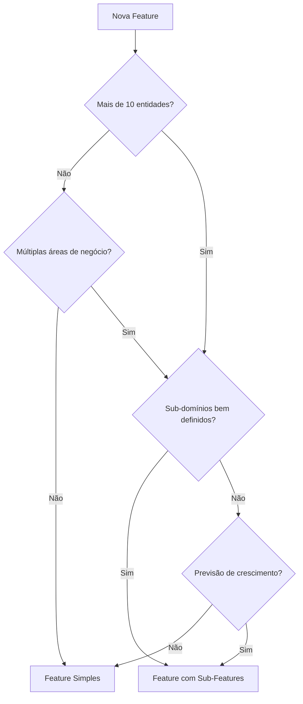

# 5. Estrutura Padrão de Pacotes

Date: 2025-12-07  
Updated: 2025-12-31

## Status

Aceito

## Contexto

A falta de padronização na estrutura de diretórios dos pacotes dificulta a navegação e o entendimento do projeto por diferentes desenvolvedores. 

Com o crescimento do projeto e a adoção de princípios de **Clean Architecture** e **Domain-Driven Design (DDD)**, precisamos de uma estrutura mais robusta que:
- Separe claramente as responsabilidades (domain/data)
- Suporte casos de uso complexos
- Facilite testes isolados
- Permita crescimento sem refatorações grandes
- Seja compatível com as melhores práticas Dart/Flutter de 2024

## Decisão

Adotar uma estrutura de diretórios **híbrida feature-first com DDD** para pacotes Dart puros e pacotes Flutter UI, com suporte a variações documentadas.

### Estrutura para Pacotes Core (Dart Puro - Domain/Data)

```
lib/
  src/
    domain/              # Camada de domínio (core business logic)
      entities/          # Objetos de domínio com identidade
      repositories/      # Interfaces/contratos de repositórios
      use_cases/         # Casos de uso/regras de negócio
      value_objects/     # Objetos de valor imutáveis (opcional)
    data/                # Camada de dados (implementações)
      models/            # DTOs e modelos de dados
      repositories/      # Implementações concretas dos repositórios
      services/          # Serviços de dados
      data_sources/      # Fontes de dados (API, cache, etc)
    validators/          # Validações de domínio (Zard schemas)
    constants/           # Constantes de domínio
    extensions/          # Extensions específicas do domínio
    enums/              # Enumerações
```

### Estrutura para Pacotes Client (HTTP)

```
lib/
  src/
    repositories/        # Repositórios locais (HTTP via Dio/Retrofit)
    services/           # Serviços cliente
    api/                # Modelos e interfaces API (opcional)
```

### Estrutura para Pacotes UI (Flutter)

```
lib/
  ui/
    pages/              # Páginas/Telas
    view_models/        # ViewModels (MVVM pattern)
    widgets/            # Widgets reutilizáveis específicos da feature
    utils/              # Utilitários UI-specific (opcional)
```

### Estrutura Obrigatória para Pacotes Core

**TODOS** os pacotes core devem seguir a estrutura Domain/Data Separados:

```
lib/src/
  domain/              # Camada de domínio (regras de negócio)
    entities/
    repositories/      # Interfaces/contratos
    use_cases/
  data/                # Camada de dados (implementações)
    models/
    repositories/      # Implementações concretas
  validators/
  constants/
  extensions/
  enums/
```

> [!IMPORTANT]
> **Padrão Obrigatório**
> 
> Esta estrutura é **obrigatória** para todos os pacotes core, sem exceções. Pacotes existentes que não seguem este padrão devem ser refatorados.
> 
> **Justificativa:**
> - Separação clara entre Domain (regras de negócio) e Data (implementações)
> - Facilita crescimento futuro sem refatorações
> - Consistência em todo o monorepo
> - Suporte explícito a Clean Architecture

**Exemplos**: `auth_shared`, `aura_shared`, `user_shared`, `project_shared`

## Princípios Arquiteturais

Esta estrutura segue os princípios de:

1. **Clean Architecture**: Separação clara entre domain (regras de negócio) e data (detalhes de implementação)
2. **Domain-Driven Design**: Entidades, value objects e use cases refletem o domínio do negócio
3. **Dependency Rule**: Domain não depende de Data. Dependências apontam sempre para dentro
4. **Single Responsibility**: Cada pasta tem um propósito claro e único

## Features vs Sub-Features

O projeto suporta **dois padrões** de organização de features:

### Feature Simples

Estrutura direta com 4 pacotes no mesmo nível:

```
packages/auth/
├── README.md
├── CONTRIBUTING.md
├── CHANGELOG.md
├── auth_shared/
├── auth_client/
├── auth_server/
└── auth_ui/
```

**Quando usar:**
- Feature coesa com domínio único
- Até ~10 entidades relacionadas
- Não há necessidade de versionamento independente de sub-domínios

**Exemplos:** `user`, `auth`

### Feature com Sub-Features

Estrutura hierárquica com domínio pai contendo múltiplas sub-features:

```
packages/financial/                   # Domínio pai
├── README.md                         # Visão geral de TODAS as sub-features
├── CONTRIBUTING.md                   # ÚNICO para todo o domínio
├── CHANGELOG.md                      # Reúne as mudanças de todas as sub-features
├── billing/                          # Sub-feature 1
│   ├── README.md
│   ├── CHANGELOG.md
│   ├── billing_shared/
│   ├── billing_client/
│   ├── billing_server/
│   └── billing_ui/
│
└── payments/                         # Sub-feature 2
    ├── README.md
    ├── CHANGELOG.md
    ├── payments_shared/
    ├── payments_client/
    ├── payments_server/
    └── payments_ui/
```

**Quando usar:**
- Domínio amplo com sub-domínios relacionados mas distintos
- Mais de ~10 entidades ou múltiplas áreas de negócio
- Necessidade de versionamento independente de componentes

**Exemplos:** `financial` (com `billing` e `payments`)

**Nomenclatura:** `{sub_feature}_{tipo}` (ex: `billing_shared`, `billing_ui`)

> [!IMPORTANT]
> **Independência de Sub-Features**
> 
> Cada sub-feature é **completamente independente** e não deve compartilhar entidades:
> - ✅ Correto: `class Invoice { final String paymentId; }` (referência por ID)
> - ❌ Incorreto: `class Invoice { final Payment payment; }` (acoplamento entre sub-features)
> 
> Isso garante evolução independente e previne acoplamento entre sub-domínios.

> [!WARNING]
> **Caminhos Relativos em Sub-Features**
> 
> Sub-features têm profundidade extra, então os caminhos relativos mudam:
> ```yaml
> # Feature simples: packages/auth/auth_shared/
> include: ../../../analysis_options_dart.yaml
> 
> # Sub-feature: packages/financial/billing/billing_shared/
> include: ../../../../analysis_options_dart.yaml  # ⚠️ Um nível a mais!
> ```

### Critérios de Decisão

Use este fluxo de decisão para escolher entre Feature Simples e Sub-Features:



**Sinais para migrar de Feature Simples para Sub-Features:**
1. Feature ultrapassou ~10-15 entidades
2. Múltiplas áreas de negócio começam a emergir
3. Necessidade de evoluir partes independentemente
4. Diferentes times trabalhando em aspectos diferentes do domínio
5. Dificuldade em navegar ou entender a estrutura atual

Para detalhes completos sobre Features vs Sub-Features, consulte [Hierarquia de Features](../architecture/features_hierarchy.md).


## Exemplos Práticos

### Exemplo 1: Pacote User Core

```
packages/user/
  ├── README.md                       # Visão geral da feature user
  ├── CONTRIBUTING.md                 # Guia de contribuição (Único arquivo)
  └── user_shared/
      ├── lib/
      │   └── src/
      │       ├── domain/
      │       │   ├── entities/
      │       │   │   ├── user.dart                    # Entidade de domínio
      │       │   │   └── user_details.dart
      │       │   ├── repositories/
      │       │   │   └── user_repository.dart         # Interface/contrato
      │       │   └── use_cases/
      │       │       ├── create_user_use_case.dart
      │       │       ├── get_users_use_case.dart
      │       │       ├── update_user_use_case.dart
      │       │       └── delete_user_use_case.dart
      │       ├── data/
      │       │   ├── models/
      │       │   │   └── user_model.dart              # DTO para serialização
      │       │   └── repositories/
      │       │       └── user_repository_impl.dart    # Implementação (se necessário)
      │       ├── validators/
      │       │   └── user_details_validator.dart    # Zard schema
      │       ├── constants/
      │       │   └── user_constants.dart
      │       └── extensions/
      │           └── user_extensions.dart
      ├── user_shared.dart                     # Barrel export
      ├── pubspec.yaml
      ├── analysis_options.yaml
      ├── README.md                            # Específico do user_shared
      └── CHANGELOG.md                         # Versionamento do core
```

### Exemplo 2: Pacote User Client

```
packages/user/user_client/
  ├── lib/
  │   └── src/
  │       ├── repositories/
  │       │   └── user_repository_client.dart    # Implementação HTTP
  │       └── services/
  │           └── user_api_service.dart          # Retrofit service
  ├── user_client.dart
  ├── pubspec.yaml
  ├── analysis_options.yaml
  ├── README.md                                # Específico do client
  └── CHANGELOG.md                             # Versionamento do client
```

> **Nota**: `CONTRIBUTING.md` NÃO está aqui, está em `packages/user/CONTRIBUTING.md`

### Exemplo 3: Pacote User UI

```
packages/user/user_ui/
  ├── lib/
  │   ├── ui/
  │   │   ├── pages/
  │   │   │   ├── user_page.dart
  │   │   │   └── user_details_page.dart
  │   │   ├── view_models/
  │   │   │   └── user_view_model.dart
  │   │   └── widgets/
  │   │       ├── user_card.dart
  │   │       └── user_list.dart
  │   ├── user_module.dart                   # AppModule
  │   └── user_ui.dart
  ├── pubspec.yaml
  ├── analysis_options.yaml
  ├── README.md                                # Específico do UI
  └── CHANGELOG.md                             # Versionamento do UI
```

## Plano de Migração

Para garantir consistência em todo o monorepo:

1. **Novos pacotes**: DEVEM usar obrigatoriamente a estrutura Domain/Data Separados
2. **Pacotes existentes fora do padrão**: DEVEM ser refatorados para seguir a estrutura obrigatória
   - Refatoração deve ser planejada e executada sistematicamente
   - Priorizar pacotes mais críticos ou com maior atividade de desenvolvimento
   - Criar issues para rastrear refatorações pendentes
3. **Sem exceções**: Não há justificativa para manter estruturas alternativas
   - Consistência é prioridade sobre conveniência temporária
   - Toda a equipe deve seguir o mesmo padrão

> [!WARNING]
> **Estruturas alternativas não são permitidas**
> 
> Pacotes que ainda não seguem este padrão devem ser documentados como **débito técnico** e incluídos no roadmap de refatoração.

## Arquivos de Documentação e Configuração

### Hierarquia de Documentação

Em um monorepo, a documentação deve seguir uma hierarquia clara:

#### Nível 1: Raiz da Feature (`packages/{{feature}}/`)

Arquivos **obrigatórios** na raiz de cada feature (ex: `packages/user/`):

- ✅ **README.md**: Visão geral da feature completa
  - Descrição da feature e seus módulos (_shared, _client, _server, _ui)
  - Arquitetura geral da feature
  - Links para README de cada subpacote
  - Como executar testes da feature completa
  
- ✅ **CONTRIBUTING.md**: Guia de contribuição da feature
  - Como contribuir em qualquer pacote desta feature
  - Padrões específicos de código da feature
  - Convenções de commit
  - Como executar testes
  - **Nota**: Este arquivo É ÚNICO por feature, NÃO deve ser duplicado nos subpacotes

- ✅ **CHANGELOG.md**: Histórico agregado da feature
  - Documenta mudanças gerais que afetam múltiplos subpacotes
  - Seguir formato [Keep a Changelog](https://keepachangelog.com/)
  - Linkar para CHANGELOGs específicos dos subpacotes quando relevante

#### Nível 2: Pacotes Individuais (`packages/{{feature}}/{{feature}}_{{type}}/`)

Arquivos **obrigatórios** em cada subpacote (ex: `packages/user/user_shared/`):

- ✅ **README.md**: Documentação específica do pacote
  - Objetivo e responsabilidade do pacote
  - Como usar/importar o pacote
  - Exemplos de código (se aplicável)
  - Dependências principais
  - API pública do pacote

- ✅ **CHANGELOG.md**: Histórico de mudanças do pacote
  - Seguir formato [Keep a Changelog](https://keepachangelog.com/)
  - Formato: `## [version] - YYYY-MM-DD`
  - Categorias: Added, Changed, Deprecated, Removed, Fixed, Security
  - Essencial para versionamento independente

- ✅ **pubspec.yaml**: Configuração do pacote Dart
  - Dependências
  - Metadados (name, version, description)
  - Configurações específicas do pacote

- ✅ **analysis_options.yaml**: Configurações de linting ⚠️ **REGRA OBRIGATÓRIA**
  - **Pacotes Dart** (_shared, _server, _client): **DEVEM** importar `analysis_options_dart.yaml` da raiz:
    ```yaml
    include: ../../../analysis_options_dart.yaml
    ```
  - **Pacotes Flutter** (_ui): **DEVEM** importar `analysis_options_flutter.yaml` da raiz:
    ```yaml
    include: ../../../analysis_options_flutter.yaml
    ```
  - Podem adicionar customizações específicas do pacote abaixo da importação
  - **Nunca** duplicar regras que já estão nos arquivos da raiz
  - Isso garante consistência de linting em todo o monorepo

### Exemplo de Estrutura Completa

```
packages/user/
  ├── README.md                    # Visão geral da feature user
  ├── CONTRIBUTING.md              # Como contribuir (NÃO duplicar)
  ├── user_shared/
  │   ├── README.md                # Específico do shared
  │   ├── CHANGELOG.md             # Versões do shared
  │   ├── pubspec.yaml
  │   ├── analysis_options.yaml
  │   └── lib/...
  ├── user_client/
  │   ├── README.md                # Específico do client
  │   ├── CHANGELOG.md             # Versões do client
  │   ├── pubspec.yaml
  │   ├── analysis_options.yaml
  │   └── lib/...
  ├── user_server/
  │   ├── README.md
  │   ├── CHANGELOG.md
  │   ├── pubspec.yaml
  │   ├── analysis_options.yaml
  │   └── lib/...
  └── user_ui/
      ├── README.md
      ├── CHANGELOG.md
      ├── pubspec.yaml
      ├── analysis_options.yaml
      └── lib/...
```

### Princípios

1. **Evitar Duplicação**: `CONTRIBUTING.md` existe APENAS no nível da feature
2. **Hierarquia Clara**: README no nível da feature aponta para READMEs dos subpacotes
3. **Versionamento Independente**: Cada subpacote tem seu CHANGELOG
4. **Configuração Por Pacote**: `pubspec.yaml` e `analysis_options.yaml` são específicos de cada subpacote

## Consequências

### Positivas

- ✅ Consistência em todo o monorepo
- ✅ Localização previsível de arquivos
- ✅ Facilita a criação de scripts de automação
- ✅ Suporte explícito a Clean Architecture e DDD
- ✅ Domain layer puro e testável isoladamente
- ✅ Facilita onboarding de novos desenvolvedores
- ✅ Estrutura escalável para crescimento futuro
- ✅ Separação clara facilita code review
- ✅ Sub-features permitem evolução independente de sub-domínios
- ✅ Flexibilidade para escolher entre Feature Simples e Sub-Features conforme necessidade

### Negativas

- ⚠️ Mais diretórios podem intimidar iniciantes
- ⚠️ Pacotes pequenos podem parecer "over-engineered"
- ⚠️ Necessidade de educar time sobre quando usar cada variação
- ⚠️ Sub-features exigem atenção especial aos caminhos relativos (um nível a mais)
- ⚠️ Risco de acoplamento entre sub-features se regras de independência não forem seguidas

### Mitigação

- Documentar exemplos práticos (este ADR)
- Criar template/scaffold para novos pacotes
- Revisar estrutura em code reviews
- Permitir variações documentadas para casos simples

## Referências

- [Flutter Architecture Guide](https://docs.flutter.dev/app-architecture)
- [Clean Architecture - Robert C. Martin](https://blog.cleancoder.com/uncle-bob/2012/08/13/the-clean-architecture.html)
- [Domain-Driven Design](https://martinfowler.com/bliki/DomainDrivenDesign.html)
- [ADR-0001: Padrão Result](./0001-use-result-pattern-for-error-handling.md) - Tratamento de erros
- [ADR-0004: FormValidationMixin e Zard](./0004-use-form-validation-mixin-and-zard.md) - Validação de formulários
- [ADR-0006: Sincronização BaseDetails](./0006-base-details-sync.md) - Sincronização automática entre Entity e BaseDetails
- [Padrões Arquiteturais](../architecture/architecture_patterns.md) - Detalhes sobre Entities, Models (DTOs) e Details
- [Hierarquia de Features](../architecture/features_hierarchy.md) - Guia detalhado sobre Features vs Sub-Features
- [Padrões de Entities](../architecture/entity_patterns.md) - Regras e práticas sobre Entities e BaseDetails
- [Guia de Design System](../architecture/design_system_guide.md) - Padrões visuais, tipografia, cores e componentes
- [Guia de Criação de Features](../rules/new_feature.md) - Como criar novas features no projeto
- [Regras Dart/Flutter](../rules/flutter_dart_rules.md) - Convenções e regras de código


