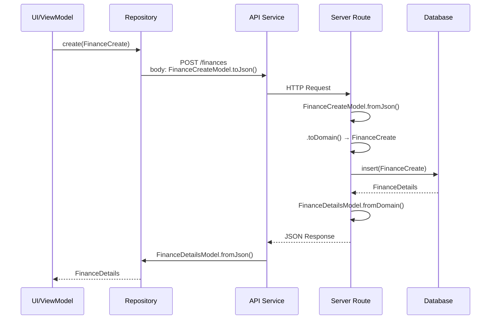
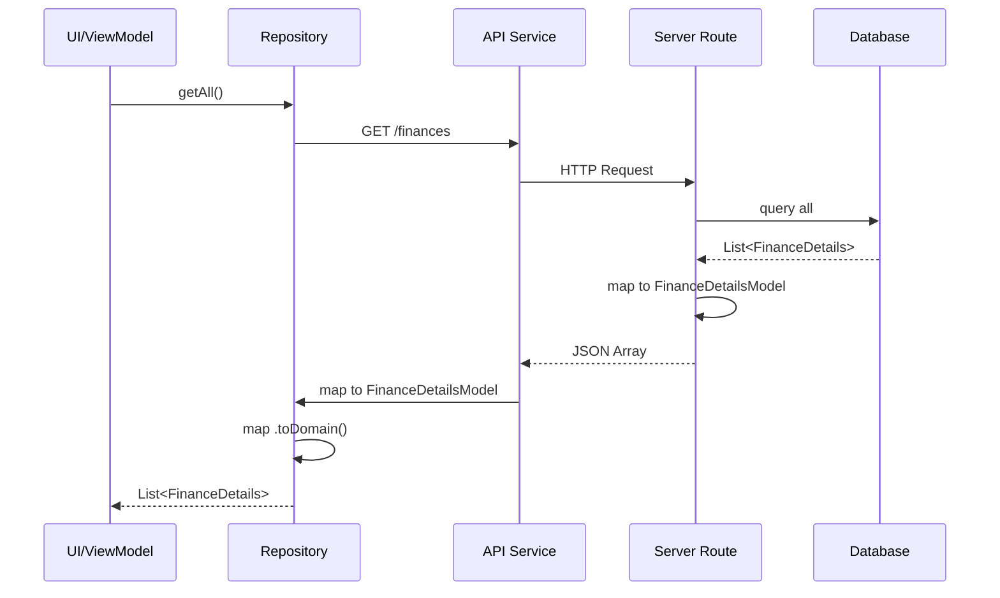

# Padrões Arquiteturais do Sistema

## Contexto

Este documento define a arquitetura refinada para entidades de domínio no EMS System, estabelecendo um padrão sólido que:
- Separa claramente responsabilidades (negócio vs. persistência)
- Mantém Clean Architecture sem violações
- Facilita automação de criação de features
- Garanta consistência em todo o monorepo

> [!TIP]
> **Guia Prático de Implementação**
> 
> Este documento foca em **decisões arquiteturais** e **conceitos fundamentais** (o "porquê" e "o quê").
> Para guia prático de implementação com exemplos código, erros comuns e checklists, consulte [entity_patterns.md](./entity_patterns.md).

## Decisões Arquiteturais Críticas

> [!IMPORTANT]
> **Entity PURA (sem `id`)**
> 
> `Entity` de domínio **NÃO terá campo `id`**. O `id` é um detalhe de persistência e deve existir apenas em `EntityDetails`. Isso mantém o domínio completamente puro e livre de preocupações de infraestrutura.
> 
> - ✅ `User` (Entity) → Apenas negócio (name, code)
> - ✅ `UserDetails` → Agregação completa (id + Entity)

> [!CAUTION]
> **Risco Crítico: Sincronização BaseDetails ↔ DriftTableMixin**
> 
> `BaseDetails` deve estar **sempre sincronizado** com `DriftTableMixinPostgres`. Se o mixin mudar (adicionar/remover campos), `BaseDetails` DEVE ser atualizado.
> 
> **Estratégia de Mitigação:**
> 1. **Fonte da Verdade:** `DriftTableMixinPostgres` é a fonte autoritativa
> 2. **Geração de Código:** Usar `build_runner` para gerar `BaseDetails` automaticamente
> 3. **Validação:** Script CI que valida sincronização entre mixin e interface
> 4. **Documentação:** Consulte [ADR-0006](../adr/0006-base-details-sync.md) para detalhes

---

## Camadas da Arquitetura

### 1. Camada de Contratos (`core_shared`)

#### BaseDetails

```dart
// packages/core/core_shared/lib/src/commons/base_details.dart
abstract class BaseDetails {
  String get id;
  bool get isDeleted;
  bool get isActive;
  DateTime get createdAt;   // NOT NULL - tem default no DB
  DateTime get updatedAt;   // NOT NULL - tem default no DB
}
```

**Propósito:** Contrato para entidades completas com metadados de persistência.

**Campos:**
- `id`: Identificador único (UUID gerado pelo banco)
- `isDeleted`: Soft delete flag
- `isActive`: Status de ativação
- `createdAt` e `updatedAt`: **Non-nullable** (`DateTime`, não `DateTime?`) pois o mixin Drift define `withDefault(CURRENT_TIMESTAMP)`

> [!NOTE]
> Não existe `BaseEntity` porque entidades de domínio puro não devem ter `id`. A identidade é responsabilidade da camada de persistência (`EntityDetails`).

---

### 2. Camada de Domínio (`*_core/domain/entities/`)

#### Entity - Domínio Puro

```dart
// Exemplo: packages/finance/finance_core/lib/src/domain/entities/finance.dart
class Finance {
  final String name;
  final String code;

  Finance({
    required this.name,
    required this.code,
  });

  // Apenas lógica de negócio
  bool get isValidCode => code.length >= 3 && code.length <= 10;
  
  String get displayName => '$code - $name';
  
  @override
  bool operator ==(Object other) =>
      identical(this, other) ||
      other is Finance && 
      runtimeType == other.runtimeType && 
      name == other.name && 
      code == other.code;

  @override
  int get hashCode => Object.hash(name, code);
  
  @override
  String toString() => 'Finance(name: $name, code: $code)';
}
```

**Características:**
- ✅ 100% domínio puro de negócio
- ✅ Apenas campos essenciais ao negócio
- ✅ Contém lógica de domínio
- ✅ Igualdade baseada em valor (value object)
- ❌ SEM `id` (detalhe de persistência)
- ❌ SEM serialização (`toJson`/`fromJson`)
- ❌ SEM dependências externas
- ❌ SEM campos de persistência

---

#### EntityDetails - Dados Completos

```dart
// Exemplo: packages/finance/finance_core/lib/src/domain/entities/finance_details.dart
import 'package:core_shared/core_shared.dart';
import 'finance.dart';

class FinanceDetails implements BaseDetails {
  // Campos do BaseDetails (alinhados com DriftTableMixinPostgres)
  @override
  final String id;
  @override
  final bool isDeleted;
  @override
  final bool isActive;
  @override
  final DateTime createdAt;   // NOT NULL
  @override
  final DateTime updatedAt;   // NOT NULL

  // Composição da Entity de negócio
  final Finance data;

  FinanceDetails({
    required this.id,
    this.isDeleted = false,
    this.isActive = true,
    required this.createdAt,
    required this.updatedAt,
    required String name,
    required String code,
  }) : data = Discipline(
         name: name,
         code: code,
       );

  // Getters de conveniência
  String get name => data.name;
  String get code => data.code;
  
  // Acesso à lógica de negócio
  bool get isValidCode => data.isValidCode;

  @override
  bool operator ==(Object other) =>
      identical(this, other) ||
      other is FinanceDetails &&
          runtimeType == other.runtimeType &&
          id == other.id;

  @override
  int get hashCode => id.hashCode;
}
```

**Características:**
- ✅ Implementa `BaseDetails`
- ✅ Contém todos os campos de `DriftTableMixinPostgres`
- ✅ Compõe `Entity` (agregação)
- ✅ Expõe campos de negócio via getters
- ❌ SEM serialização (responsabilidade de `*Model`)
- ❌ SEM dependências de infraestrutura (Drift, Shelf, etc.)

**Uso:** Transferência entre Repository ↔ UseCase/ViewModel

---

### 3. Camada de DTOs (`*_core/domain/dtos/`)

#### EntityCreate - DTO de Criação

```dart
// Exemplo: packages/finance/finance_core/lib/src/domain/dtos/finance_create.dart
class FinanceCreate {
  final String name;
  final String code;

  FinanceCreate({
    required this.name,
    required this.code,
  });

  // Validação de negócio
  bool get isValid => name.isNotEmpty && code.length >= 3;
}
```

**Características:**
- ✅ Apenas campos necessários para criação
- ❌ SEM `id` (gerado pelo banco)
- ❌ SEM campos de metadados
- ❌ SEM serialização

---

#### EntityUpdate - DTO de Atualização

```dart
// Exemplo: packages/finance/finance_core/lib/src/domain/dtos/finance_update.dart
class FinanceUpdate {
  final String id;          // Obrigatório - identifica o registro
  final String? name;       // Opcional - atualização parcial
  final String? code;       // Opcional - atualização parcial
  final bool? isActive;     // Opcional - ativar/desativar
  final bool? isDeleted;      // Opcional - soft delete

  FinanceUpdate({
    required this.id,
    this.name,
    this.code,
    this.isActive,
    this.isDeleted,
  });

  bool get hasChanges => 
    name != null || 
    code != null || 
    isActive != null || 
    isDeleted != null;
    
  // Validação
  bool get isValid => id.isNotEmpty;
}
```

**Características:**
- ✅ Requer `id` (qual registro atualizar)
- ✅ Campos opcionais (atualização parcial)
- ✅ Inclui campos de controle (`isActive`, `isDeleted`)
- ❌ **NÃO** inclui `createdAt` (imutável)
- ❌ **NÃO** inclui `updatedAt` (gerenciado pelo DB)

> [!NOTE]
> **Campos de BaseDetails em EntityUpdate**
>
> | Campo | Incluir? | Razão |
> |-------|----------|-------|
> | `id` | ✅ **SIM** (required) | Identifica o registro |
> | `isActive` | ✅ SIM (optional) | Ativar/desativar |
> | `isDeleted` | ✅ SIM (optional) | Soft delete |
> | `createdAt` | ❌ **NÃO** | Imutável - nunca muda |
> | `updatedAt` | ❌ **NÃO** | Auto-atualizado pelo DB |
>
> **Padrões de Soft Delete:**
> ```dart
> // Via Update
> await repository.update(FinanceUpdate(id: id, isDeleted: true));
> 
> // Ou método dedicado (mais semântico)
> await repository.softDelete(id);
> await repository.restore(id);
> ```

---

### 4. Camada de Models (`*_core/data/models/`)

#### EntityDetailsModel - Serialização

```dart
// Exemplo: packages/finance/finance_core/lib/src/data/models/finance_details_model.dart
import '../domain/entities/finance_details.dart';

class FinanceDetailsModel {
  final FinanceDetails entity;

  FinanceDetailsModel(this.entity);

  // Serialização
  factory FinanceDetailsModel.fromJson(Map<String, dynamic> json) {
    return FinanceDetailsModel(
      FinanceDetails(
        id: json['id'] as String,
        isDeleted: json['is_deleted'] as bool? ?? false,
        isActive: json['is_active'] as bool? ?? true,
        createdAt: DateTime.parse(json['created_at'] as String),
        updatedAt: DateTime.parse(json['updated_at'] as String),
        name: json['name'] as String,
        code: json['code'] as String,
      ),
    );
  }

  Map<String, dynamic> toJson() => {
        'id': entity.id,
        'is_deleted': entity.isDeleted,
        'is_active': entity.isActive,
        'created_at': entity.createdAt.toIso8601String(),
        'updated_at': entity.updatedAt.toIso8601String(),
        'name': entity.name,
        'code': entity.code,
      };

  // Conversão para domínio
  FinanceDetails toDomain() => entity;

  // Conversão de domínio
  factory FinanceDetailsModel.fromDomain(FinanceDetails details) =>
      FinanceDetailsModel(details);
}
```

---

#### EntityCreateModel - Serialização de Criação

```dart
// Exemplo: packages/finance/finance_core/lib/src/data/models/finance_create_model.dart
import '../domain/dtos/finance_create.dart';

class FinanceCreateModel {
  final FinanceCreate dto;

  FinanceCreateModel(this.dto);

  factory FinanceCreateModel.fromJson(Map<String, dynamic> json) {
    return FinanceCreateModel(
      FinanceCreate(
        name: json['name'] as String,
        code: json['code'] as String,
      ),
    );
  }

  Map<String, dynamic> toJson() => {
        'name': dto.name,
        'code': dto.code,
      };

  FinanceCreate toDomain() => dto;
  
  factory FinanceCreateModel.fromDomain(FinanceCreate create) =>
      FinanceCreateModel(create);
}
```

---

### 5. Camada de Infraestrutura (`*_server/database/tables/`)

#### Tabela Drift

```dart
// Exemplo: packages/finance/finance_server/lib/src/database/tables/finance_table.dart
import 'package:drift/drift.dart';
import 'package:core_server/core_server.dart';
import 'package:finance_core/finance_core.dart';

@UseRowClass(FinanceDetails)
class FinanceTable extends Table with DriftTableMixinPostgres {
  @override
  String get tableName => 'finances';

  // Apenas colunas específicas do domínio
  // (id, createdAt, updatedAt, deleted, isActive vêm do mixin)
  TextColumn get name => text()();
  TextColumn get code => text()();
}
```

**Importante:** O mixin `DriftTableMixinPostgres` fornece automaticamente:
- `id` (PK com UUID)
- `createdAt`
- `updatedAt`
- `isDeleted`
- `isActive`

---

## Estrutura de Diretórios

```
packages/
├── core/
│   ├── core_shared/
│   │   └── lib/src/commons/
│   │       └── base_details.dart         [INTERFACE]
│   └── core_server/
│       └── lib/src/database/drift/
│           └── drift_table_mixin.dart    [FONTE DA VERDADE]
│
└── <feature>/
    └── <feature>_core/
        └── lib/src/
            ├── domain/
            │   ├── entities/
            │   │   ├── <entity>.dart              (Entity pura)
            │   │   └── <entity>_details.dart      (Entity + metadados)
            │   └── dtos/
            │       ├── <entity>_create.dart       (DTO criação)
            │       └── <entity>_update.dart       (DTO atualização)
            └── data/
                └── models/
                    ├── <entity>_details_model.dart  (Serialização)
                    ├── <entity>_create_model.dart   (Serialização)
                    └── <entity>_update_model.dart   (Serialização)
```

---

## Fluxo de Dados

### Criação (Client → Server)



### Leitura (Server → Client)



---

## Benefícios da Arquitetura

### 1. **Separação de Responsabilidades**
- `Entity`: Lógica de negócio pura
- `EntityDetails`: Agregação de dados completos
- `*Create`/`*Update`: Operações específicas
- `*Model`: Serialização isolada

### 2. **Clean Architecture**
- ✅ Domínio (`Entity`, `EntityDetails`) sem dependências externas
- ✅ Infraestrutura (`*Model`, Drift) isolada
- ✅ Interfaces (`BaseDetails`) como contratos

### 3. **Facilidade de Manutenção**
- Mudanças no banco → apenas `*Table` e `BaseDetails`
- Mudanças na API → apenas `*Model`
- Mudanças no negócio → apenas `Entity`

### 4. **Automação**
- Template claro para scripts de geração
- Padrão consistente em todas as features
- Reduz erros humanos

### 5. **Testabilidade**
- Entidades puras sem dependências
- Mocks simplificados
- Testes de negócio isolados

---

## Referências

- [ADR-0005: Standard Package Structure](../adr/0005-standard-package-structure.md)
- [ADR-0006: Sincronização BaseDetails ↔ DriftTableMixin](../adr/0006-base-details-sync.md)
- [Hierarquia de Features](./features_hierarchy.md)
- [Padrões de Entities](./entity_patterns.md)
- [Guia de Criação de Features](../rules/new_feature.md)
