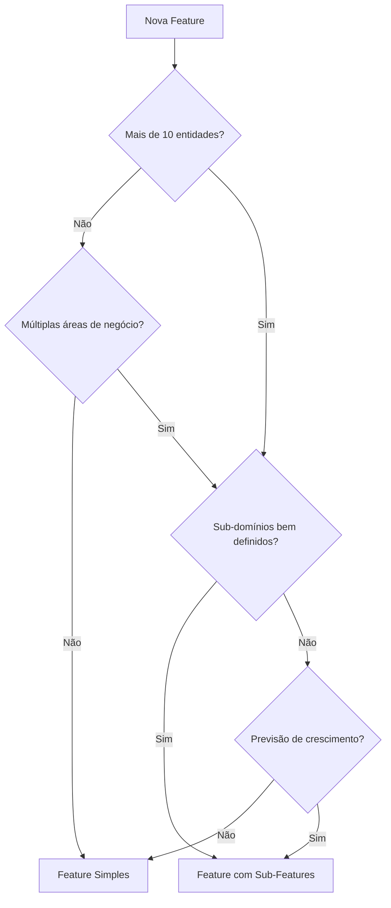

# Hierarquia de Features

## Contexto

O EMS System suporta **dois padrões** de organização de features, dependendo da complexidade e escopo do domínio:

1. **Feature Simples** → 4 pacotes diretamente (ex: `user`, `auth`)
2. **Feature com Sub-Features** → Domínio pai contendo múltiplas sub-features (ex: `financial`)

Este documento explica quando e como usar cada padrão.

---

## Padrão 1: Feature Simples

### Estrutura

```
packages/user/
├── README.md
├── CONTRIBUTING.md
├── user_core/
├── user_client/
├── user_server/
└── user_ui/
```

### Quando Usar

- Feature coesa com domínio único
- Até ~10 entidades relacionadas
- Lógica de negócio bem definida e isolada
- Não há necessidade de versionamento independente de sub-domínios

### Exemplos

- `user` - Gestão de usuários
- `auth` - Autenticação e autorização

### Características

- 4 pacotes padronizados (`*_core`, `*_client`, `*_server`, `*_ui`)
- Documentação única no nível da feature
- Caminhos relativos padrão: `../../../`

---

## Padrão 2: Feature com Sub-Features

### Estrutura

```
packages/financial/                    # Domínio pai
├── README.md                          # Visão geral de TODAS as sub-features
├── CONTRIBUTING.md                    # ÚNICO para todo o domínio
├── CHANGELOG.md
│
├── billing/                           # Sub-feature 1
│   ├── README.md
│   ├── billing_core/
│   ├── billing_client/
│   ├── billing_server/
│   └── billing_ui/
│
└── payments/                          # Sub-feature 2
    ├── README.md
    ├── payments_core/
    ├── payments_client/
    ├── payments_server/
    └── payments_ui/
```

### Quando Usar

- Domínio amplo com sub-domínios relacionados mas distintos
- Necessidade de versionamento independente de componentes
- Mais de ~10 entidades ou múltiplas áreas de negócio dentro do mesmo contexto
- Sub-domínios que podem evoluir em ritmos diferentes

### Exemplos

#### `financial/`
- **Sub-feature 1:** `billing/` - Faturamento e cobranças
- **Sub-feature 2:** `payments/` - Processamento de pagamentos
- **Sub-feature 3:** `reports/` - Relatórios financeiros

### Exemplos Futuros

#### `enrollment/`
- `registration/` - Registro de matrículas
- `documents/` - Gestão de documentação
- `validation/` - Validação de requisitos

#### `hr/` (Recursos Humanos)
- `employees/` - Gestão de funcionários
- `payroll/` - Folha de pagamento
- `attendance/` - Controle de ponto

---

## Nomenclatura em Sub-Features

### Regra

**Formato:** `{sub_feature}_{tipo}`

### ✅ Correto

```
financial/
├── billing/
│   ├── billing_core/
│   ├── billing_client/
│   ├── billing_server/
│   └── billing_ui/
└── payments/
    ├── payments_core/
    ├── payments_client/
    ├── payments_server/
    └── payments_ui/
```

### ❌ Incorreto

```
financial/
├── financial_core/        # ❌ Qual sub-feature?
├── billing_core/          # ❌ Perde contexto do domínio pai
└── payments/              # ❌ Nome muito genérico
```

### Justificativa

- **Clareza:** Nome completo identifica tanto o domínio pai quanto a sub-feature
- **Evita Conflitos:** Previne colisões de nomes entre diferentes domínios
- **Facilita Busca:** Pesquisar por "billing" retorna todos os pacotes relacionados
- **Consistência:** Padrão uniforme em todo o monorepo

---

## Caminhos Relativos

Sub-features têm profundidade extra na hierarquia de diretórios, o que afeta caminhos relativos para arquivos de configuração compartilhados.

### Feature Simples

```yaml
# packages/user/user_core/pubspec.yaml
# Profundidade: packages/user/user_core/

include: ../../../analysis_options_dart.yaml
```

**Hierarquia:**
```
[raiz]/
└── packages/         # -3
    └── user/       # -2
        └── user_core/  # -1 (atual)
```

### Sub-Feature

```yaml
# packages/financial/billing/billing_core/pubspec.yaml
# Profundidade: packages/financial/billing/billing_core/

include: ../../../../analysis_options_dart.yaml  # ⚠️ Um nível a mais!
```

**Hierarquia:**
```
[raiz]/
└── packages/                  # -4
    └── financial/              # -3
        └── billing/            # -2
            └── billing_core/  # -1 (atual)
```

> [!WARNING]
> **Atenção:** Ao criar sub-features, sempre adicione um `../` extra nos caminhos relativos comparado a features simples.

---

## Organização da Documentação

### Feature com Sub-Features

#### No Nível do Domínio Pai (`packages/financial/`)

**README.md**
- Visão geral do domínio `financial`
- Lista e descreve todas as sub-features
- Diagrama de relacionamentos entre sub-features
- Links para READMEs específicos de cada sub-feature

**CONTRIBUTING.md**
- Regras de contribuição **únicas** para todo o domínio
- Padrões de código específicos do contexto financeiro
- Workflow de desenvolvimento

**CHANGELOG.md**
- Histórico de mudanças consolidado de todas as sub-features
- Versionamento coordenado quando necessário

#### No Nível da Sub-Feature (`packages/financial/billing/`)

**README.md**
- Documentação específica da sub-feature
- Entidades e casos de uso
- Exemplos de uso da API
- Link de volta para o README do domínio pai

---

## Aplicação da Arquitetura

### Independência de Sub-Features

**Cada sub-feature é independente e segue o padrão completo de camadas:**

```
financial/
├── billing_core/
│   └── lib/src/
│       ├── domain/entities/
│       │   ├── invoice.dart                   # Entity pura
│       │   ├── invoice_details.dart           # Details
│       │   ├── billing_plan.dart
│       │   ├── billing_plan_details.dart
│       │   └── dtos/...
│       └── data/models/...
│
└── payments_core/
    └── lib/src/
        ├── domain/entities/
        │   ├── payment.dart                    # Entity pura
        │   ├── payment_details.dart
        │   ├── payment_method.dart
        │   ├── payment_method_details.dart
        │   └── dtos/...
        └── data/models/...
```

### Regra Crítica: Não Compartilhar Entidades

> [!CAUTION]
> **Não compartilhe entidades entre sub-features!**
> 
> Cada sub-feature deve ter suas próprias entidades, mesmo que pareçam similares. Isso mantém:
> - **Independência:** Sub-features podem evoluir separadamente
> - **Coesão:** Cada sub-feature tem suas próprias regras de negócio
> - **Versionamento:** Mudanças em uma sub-feature não quebram outras

**❌ Incorreto:**
```dart
// billing_core usando entity de payments
import 'package:payments_core/payments_core.dart';

class Invoice {
  final Payment payment;  // ❌ Acoplamento entre sub-features
}
```

**✅ Correto:**
```dart
// billing_core tem sua própria referência
class Invoice {
  final String paymentId;  // ✅ Apenas referência por ID
}
```

---

## Quando Migrar de Feature Simples para Sub-Features

### Sinais de que é hora de migrar:

1. **Crescimento:** Feature ultrapassou ~10-15 entidades
2. **Complexidade:** Múltiplas áreas de negócio começam a emergir
3. **Versionamento:** Necessidade de evoluir partes independentemente
4. **Equipes:** Diferentes times trabalhando em aspectos diferentes do domínio
5. **Clareza:** Dificuldade em navegar ou entender a estrutura atual

### Processo de Migração:

1. Identificar sub-domínios naturais dentro da feature
2. Criar estrutura de diretórios para sub-features
3. Mover pacotes para suas respectivas sub-features
4. Atualizar caminhos relativos (`../../../` → `../../../../`)
5. Criar README.md no nível do domínio pai
6. Mover CONTRIBUTING.md para o nível pai
7. Atualizar importações em outros pacotes
8. Executar testes para validar migração

---

## Decisão: Feature Simples vs Sub-Features



---

## Exemplos Práticos

### Feature Simples: `user`

```
packages/user/
├── README.md                    # Documentação de usuários
├── CONTRIBUTING.md
├── user_core/                   # Domínio de usuário
│   └── lib/src/domain/entities/
│       ├── user.dart
│       └── user_details.dart
├── user_client/                 # Cliente HTTP
├── user_server/                 # API Server
└── user_ui/                     # Componentes UI
```

**Justificativa:** Domínio coeso, ~5 entidades, lógica bem definida.

---

### Feature com Sub-Features: `financial`

```
packages/financial/
├── README.md                              # Overview de financial
├── CONTRIBUTING.md                        # Regras para todo financial
│
├── billing/                               # Sub-domínio: Faturamento
│   ├── README.md
│   ├── billing_core/
│   │   └── domain/entities/
│   │       ├── invoice.dart                   # 1. Faturas
│   │       ├── billing_plan.dart              # 2. Planos de cobrança
│   │       └── billing_cycle.dart             # 3. Ciclos de cobrança
│   ├── billing_client/
│   ├── billing_server/
│   └── billing_ui/
│
└── payments/                              # Sub-domínio: Pagamentos
    ├── README.md
    ├── payments_core/
    │   └── domain/entities/
    │       ├── payment.dart                   # 1. Pagamentos
    │       └── payment_method.dart            # 2. Métodos de pagamento
    ├── payments_client/
    ├── payments_server/
    └── payments_ui/
```

**Justificativa:** Duas áreas distintas (faturamento vs pagamentos), evolução independente, ~5-7 entidades.

---

## Referências

- [Padrões Arquiteturais](../analysis/architecture_patterns.md)
- [ADR-0005: Standard Package Structure](../adr/0005-standard-package-structure.md)
- [Guia de Criação de Features](../rules/new_feature.md)
- [Padrões de Entities](../rules/entity_patterns.md)
