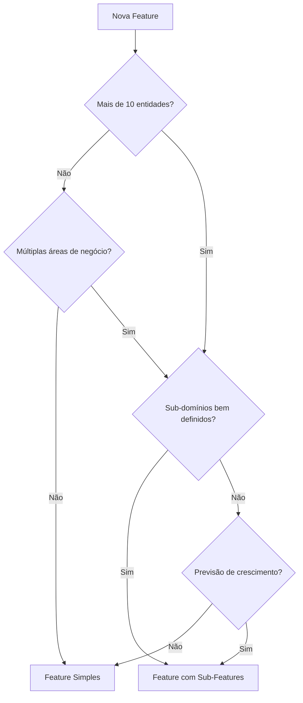

# Hierarquia de Features

## Contexto

O School Manager System suporta **dois padrões** de organização de features, dependendo da complexidade e escopo do domínio:

1. **Feature Simples** → 4 pacotes diretamente (ex: `school`, `user`, `auth`)
2. **Feature com Sub-Features** → Domínio pai contendo múltiplas sub-features (ex: `academic`)

Este documento explica quando e como usar cada padrão.

---

## Padrão 1: Feature Simples

### Estrutura

```
packages/school/
├── README.md
├── CONTRIBUTING.md
├── school_core/
├── school_client/
├── school_server/
└── school_ui/
```

### Quando Usar

- Feature coesa com domínio único
- Até ~10 entidades relacionadas
- Lógica de negócio bem definida e isolada
- Não há necessidade de versionamento independente de sub-domínios

### Exemplos

- `school` - Gestão de escolas
- `user` - Gestão de usuários
- `auth` - Autenticação e autorização

### Características

- 4 pacotes padronizados (`*_core`, `*_client`, `*_server`, `*_ui`)
- Documentação única no nível da feature
- Caminhos relativos padrão: `../../../`

---

## Padrão 2: Feature com Sub-Features

### Estrutura

```
packages/academic/                     # Domínio pai
├── README.md                          # Visão geral de TODAS as sub-features
├── CONTRIBUTING.md                    # ÚNICO para todo o domínio
├── CHANGELOG.md
│
├── academic_structure/                # Sub-feature 1
│   ├── README.md
│   ├── academic_structure_core/
│   ├── academic_structure_client/
│   ├── academic_structure_server/
│   └── academic_structure_ui/
│
└── academic_config/                    # Sub-feature 2
    ├── README.md
    ├── academic_config_core/
    ├── academic_config_client/
    ├── academic_config_server/
    └── academic_config_ui/
```

### Quando Usar

- Domínio amplo com sub-domínios relacionados mas distintos
- Necessidade de versionamento independente de componentes
- Mais de ~10 entidades ou múltiplas áreas de negócio dentro do mesmo contexto
- Sub-domínios que podem evoluir em ritmos diferentes

### Exemplos Atuais

#### `academic/`
- **Sub-feature 1:** `academic_structure/` - Estrutura acadêmica (disciplinas, áreas de conhecimento, níveis)
- **Sub-feature 2:** `academic_config/` - Configurações acadêmicas (anos letivos, calendários)

### Exemplos Futuros

#### `finance/`
- `billing/` - Faturamento e cobranças
- `payments/` - Processamento de pagamentos
- `reports/` - Relatórios financeiros

#### `enrollment/`
- `registration/` - Registro de matrículas
- `documents/` - Gestão de documentação
- `validation/` - Validação de requisitos

---

## Nomenclatura em Sub-Features

### Regra

**Formato:** `{sub_feature}_{tipo}`

### ✅ Correto

```
academic/
├── academic_structure/
│   ├── academic_structure_core/
│   ├── academic_structure_client/
│   ├── academic_structure_server/
│   └── academic_structure_ui/
└── academic_config/
    ├── academic_config_core/
    ├── academic_config_client/
    ├── academic_config_server/
    └── academic_config_ui/
```

### ❌ Incorreto

```
academic/
├── academic_core/        # ❌ Qual sub-feature?
├── structure_core/       # ❌ Perde contexto do domínio pai
└── config/              # ❌ Nome muito genérico
```

### Justificativa

- **Clareza:** Nome completo identifica tanto o domínio pai quanto a sub-feature
- **Evita Conflitos:** Previne colisões de nomes entre diferentes domínios
- **Facilita Busca:** Pesquisar por "academic_structure" retorna todos os pacotes relacionados
- **Consistência:** Padrão uniforme em todo o monorepo

---

## Caminhos Relativos

Sub-features têm profundidade extra na hierarquia de diretórios, o que afeta caminhos relativos para arquivos de configuração compartilhados.

### Feature Simples

```yaml
# packages/school/school_core/pubspec.yaml
# Profundidade: packages/school/school_core/

include: ../../../analysis_options_dart.yaml
```

**Hierarquia:**
```
[raiz]/
└── packages/         # -3
    └── school/       # -2
        └── school_core/  # -1 (atual)
```

### Sub-Feature

```yaml
# packages/academic/academic_structure/academic_structure_core/pubspec.yaml
# Profundidade: packages/academic/academic_structure/academic_structure_core/

include: ../../../../analysis_options_dart.yaml  # ⚠️ Um nível a mais!
```

**Hierarquia:**
```
[raiz]/
└── packages/                  # -4
    └── academic/              # -3
        └── academic_structure/    # -2
            └── academic_structure_core/  # -1 (atual)
```

> [!WARNING]
> **Atenção:** Ao criar sub-features, sempre adicione um `../` extra nos caminhos relativos comparado a features simples.

---

## Organização da Documentação

### Feature com Sub-Features

#### No Nível do Domínio Pai (`packages/academic/`)

**README.md**
- Visão geral do domínio `academic`
- Lista e descreve todas as sub-features
- Diagrama de relacionamentos entre sub-features
- Links para READMEs específicos de cada sub-feature

**CONTRIBUTING.md**
- Regras de contribuição **únicas** para todo o domínio
- Padrões de código específicos do contexto acadêmico
- Workflow de desenvolvimento

**CHANGELOG.md**
- Histórico de mudanças consolidado de todas as sub-features
- Versionamento coordenado quando necessário

#### No Nível da Sub-Feature (`packages/academic/academic_structure/`)

**README.md**
- Documentação específica da sub-feature
- Entidades e casos de uso
- Exemplos de uso da API
- Link de volta para o README do domínio pai

---

## Aplicação da Arquitetura

### Independência de Sub-Features

**Cada sub-feature é independente e segue o padrão completo de camadas:**

```
academic/
├── academic_structure_core/
│   └── lib/src/
│       ├── domain/entities/
│       │   ├── discipline.dart              # Entity pura
│       │   ├── discipline_details.dart      # Details
│       │   ├── knowledge_area.dart
│       │   ├── knowledge_area_details.dart
│       │   └── dtos/...
│       └── data/models/...
│
└── academic_config_core/
    └── lib/src/
        ├── domain/entities/
        │   ├── academic_year_config.dart         # Entity pura
        │   ├── academic_year_config_details.dart
        │   └── dtos/...
        └── data/models/...
```

### Regra Crítica: Não Compartilhar Entidades

> [!CAUTION]
> **Não compartilhe entidades entre sub-features!**
> 
> Cada sub-feature deve ter suas próprias entidades, mesmo que pareçam similares. Isso mantém:
> - **Independência:** Sub-features podem evoluir separadamente
> - **Coesão:** Cada sub-feature tem suas próprias regras de negócio
> - **Versionamento:** Mudanças em uma sub-feature não quebram outras

**❌ Incorreto:**
```dart
// academic_structure_core usando entity de academic_config
import 'package:academic_config_core/academic_config_core.dart';

class Discipline {
  final AcademicYearConfig config;  // ❌ Acoplamento entre sub-features
}
```

**✅ Correto:**
```dart
// academic_structure_core tem sua própria referência
class Discipline {
  final String academicYearConfigId;  // ✅ Apenas referência por ID
}
```

---

## Quando Migrar de Feature Simples para Sub-Features

### Sinais de que é hora de migrar:

1. **Crescimento:** Feature ultrapassou ~10-15 entidades
2. **Complexidade:** Múltiplas áreas de negócio começam a emergir
3. **Versionamento:** Necessidade de evoluir partes independentemente
4. **Equipes:** Diferentes times trabalhando em aspectos diferentes do domínio
5. **Clareza:** Dificuldade em navegar ou entender a estrutura atual

### Processo de Migração:

1. Identificar sub-domínios naturais dentro da feature
2. Criar estrutura de diretórios para sub-features
3. Mover pacotes para suas respectivas sub-features
4. Atualizar caminhos relativos (`../../../` → `../../../../`)
5. Criar README.md no nível do domínio pai
6. Mover CONTRIBUTING.md para o nível pai
7. Atualizar importações em outros pacotes
8. Executar testes para validar migração

---

## Decisão: Feature Simples vs Sub-Features



---

## Exemplos Práticos

### Feature Simples: `user`

```
packages/user/
├── README.md                    # Documentação de usuários
├── CONTRIBUTING.md
├── user_core/                   # Domínio de usuário
│   └── lib/src/domain/entities/
│       ├── user.dart
│       └── user_details.dart
├── user_client/                 # Cliente HTTP
├── user_server/                 # API Server
└── user_ui/                     # Componentes UI
```

**Justificativa:** Domínio coeso, ~5 entidades, lógica bem definida.

---

### Feature com Sub-Features: `academic`

```
packages/academic/
├── README.md                              # Overview de academic
├── CONTRIBUTING.md                        # Regras para todo academic
│
├── academic_structure/                    # Sub-domínio: Estrutura
│   ├── README.md
│   ├── academic_structure_core/
│   │   └── domain/entities/
│   │       ├── discipline.dart            # 1. Disciplinas
│   │       ├── knowledge_area.dart        # 2. Áreas de conhecimento
│   │       └── grade_level.dart           # 3. Níveis escolares
│   ├── academic_structure_client/
│   ├── academic_structure_server/
│   └── academic_structure_ui/
│
└── academic_config/                        # Sub-domínio: Configuração
    ├── README.md
    ├── academic_config_core/
    │   └── domain/entities/
    │       ├── academic_year_config.dart  # 1. Configuração de ano letivo
    │       └── calendar_config.dart       # 2. Calendário acadêmico
    ├── academic_config_client/
    ├── academic_config_server/
    └── academic_config_ui/
```

**Justificativa:** Duas áreas distintas (estrutura vs configuração), evolução independente, ~8 entidades.

---

## Referências

- [Padrões Arquiteturais](./architecture_patterns.md)
- [ADR-0005: Standard Package Structure](../adr/0005-standard-package-structure.md)
- [Guia de Criação de Features](../rules/new_feature.md)
- [Padrões de Entities](../rules/entity_patterns.md)
