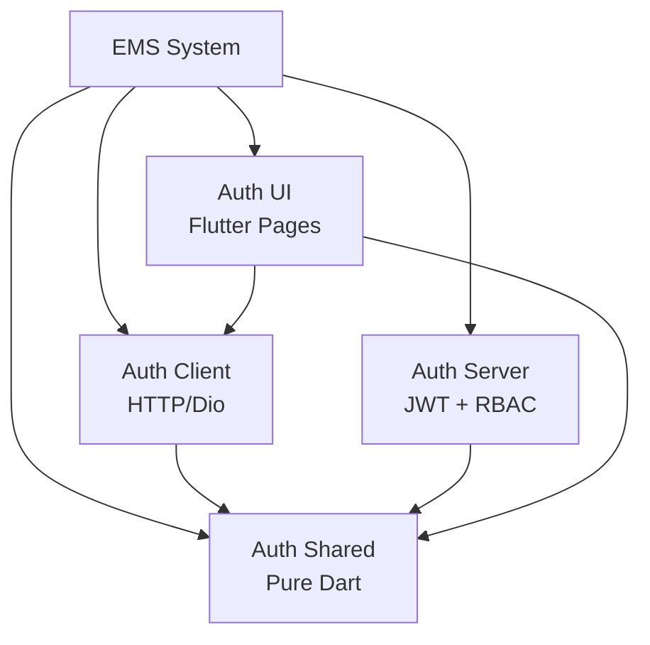

# Auth Feature


O **Auth** é a feature de autenticação e autorização do EMS System, implementando um sistema robusto de **Role-Based Access Control (RBAC)** em dois níveis: papéis globais e papéis por feature.

## 📋 Visão Geral

O Auth fornece infraestrutura completa para autenticação JWT, gestão de sessões com refresh token rotation, e um sistema inovador de autorização granular que permite controle de acesso global e específico por feature (projetos, finanças, tarefas, etc.).

## 🏗️ Arquitetura



### Subpacotes

| Pacote | Versão | Tipo | Responsabilidade |
|--------|--------|------|------------------|
| **[Auth Shared](./auth_shared/)** | 1.0.0 | Pure Dart | Modelos de domínio, DTOs, interfaces de repositório |
| **[Auth Client](./auth_client/)** | 1.0.0 | Dart | Cliente HTTP para autenticação (login, registro, refresh) |
| **[Auth Server](./auth_server/)** | 1.0.0 | Dart | Backend com JWT, bcrypt, RBAC global e por feature |
| **[Auth UI](./auth_ui/)** | 1.0.0 | Flutter | Páginas de login, registro, recuperação de senha |

## ✨ Features Principais

### Autenticação
- ✅ **Login** com email/senha
- ✅ **Registro** de novos usuários
- ✅ **Refresh Token** com rotação automática
- ✅ **Recuperação de Senha** (Forgot/Reset Password)
- ✅ **Alteração de Senha** para usuários autenticados
- ✅ **JWT Authentication** com tokens de acesso e renovação

### Autorização

#### 1. RBAC Global (UserRole)
Papéis hierárquicos no nível do sistema:

- **Owner (4)** - Proprietário do sistema, acesso total
- **Admin (3)** - Administrador global, bypassa verificações de features
- **Manager (2)** - Gerente com permissões limitadas
- **User (1)** - Usuário comum (padrão)

> [!IMPORTANT]
> Usuários com papel `admin` ou `owner` têm acesso irrestrito a todas as features, ignorando verificações de papéis específicos.

#### 2. RBAC por Feature (FeatureUserRole)
Controle granular de acesso para features individuais (projetos, finanças, tarefas):

- **Owner (5)** - Proprietário da feature
- **Admin (4)** - Administrador da feature
- **Manager (3)** - Gerente (pode adicionar/remover membros)
- **Member (2)** - Membro contribuidor
- **Viewer (1)** - Visualizador (somente leitura)

**Implementação de Referência:**
- `ProjectUserRoleRepository` - Gestão de membros de projetos
- `ProjectUserRoleService` - Lógica de negócio para papéis
- `ProjectUserRoleRoutes` - Rotas protegidas por papel
- `FeatureRoleMiddleware` - Middleware para verificação

### Segurança
- ✅ **JWT** (JSON Web Tokens) para autenticação stateless
- ✅ **Bcrypt** para hashing de senhas
- ✅ **Refresh Token Rotation** - Maior segurança
- ✅ **AuthMiddleware** - Proteção de rotas
- ✅ **FeatureRoleMiddleware** - Verificação granular de permissões

## 🚀 Instalação

Para utilizar este feature, adicione as dependências apropriadas:

```yaml
dependencies:
  # Para autenticação client-side (Flutter apps)
  auth_client: ^1.0.0
  auth_shared: ^1.0.0
  auth_ui: ^1.0.0
  
  # Para backend (Dart servers)
  auth_server: ^1.0.0
  auth_shared: ^1.0.0
```

> [!NOTE]
> Este projeto utiliza **Dart Workspaces**. As dependências são resolvidas automaticamente.

## 📖 Uso

### Cliente (Flutter)

#### Login e Autenticação

```dart
import 'package:auth_client/auth_client.dart';

// 1. Login
final result = await authService.login(LoginRequest(
  email: 'user@example.com',
  password: 'password123',
));

if (result case Success(value: final user)) {
  print('Bem-vindo, ${user.name}!');
} else if (result case Failure(error: final e)) {
  print('Erro: $e');
}

// 2. Verificar se está autenticado
final isAuth = await authService.isAuthenticated();

// 3. Logout
await authService.logout();
```

#### Registro de Usuário

```dart
final result = await authService.register(RegisterRequest(
  name: 'João Silva',
  email: 'joao@example.com',
  username: 'joaosilva',
  password: 'senha123',
));
```

#### Recuperação de Senha

```dart
// Solicita email de reset
await authService.forgotPassword(
  ForgotPasswordRequest(email: 'user@example.com'),
);

// Redefine senha com token do email
await authService.resetPassword(ResetPasswordRequest(
  token: 'token-from-email',
  newPassword: 'novaSenha123',
));
```

### Servidor (Backend)

#### Proteger Rotas com Autenticação

```dart
import 'package:auth_server/auth_server.dart';

router.get(
  '/protected',
  Pipeline()
    .addMiddleware(authMiddleware.protect())
    .addHandler(_protectedHandler),
);
```

#### Proteger com Papel Global

```dart
router.get(
  '/admin',
  Pipeline()
    .addMiddleware(authMiddleware.requireRole(UserRole.admin))
    .addHandler(_adminHandler),
);
```

#### Proteger com Papel de Feature

```dart
router.post(
  '/projects/<projectId>/tasks',
  Pipeline()
    .addMiddleware(authMiddleware.protect())
    .addMiddleware(featureRoleMiddleware.requireFeatureRole(
      FeatureUserRole.member,  // Papel mínimo necessário
      (req) => req.params['projectId']!,  // Extrator de feature ID
    ))
    .addHandler(_createTaskHandler),
);
```

#### Implementar RBAC para Nova Feature

Para adicionar controle de acesso a uma nova feature (ex: financeiro):

1. **Criar Repository** seguindo `ProjectUserRoleRepository`
2. **Criar Service** com lógica de negócio
3. **Criar Routes** protegidas com `FeatureRoleMiddleware`
4. **Definir Tabela** no banco com relacionamento user-feature-role

Exemplo completo disponível em: `packages/auth/auth_server/lib/src/repository/project_user_role_repository.dart`

## 🔐 API Endpoints

| Método | Endpoint | Descrição | Auth |
|--------|----------|-----------|------|
| `POST` | `/auth/login` | Login com email/senha | ❌ |
| `POST` | `/auth/register` | Registro de novo usuário | ❌ |
| `POST` | `/auth/refresh` | Renovar access token | ❌ |
| `POST` | `/auth/forgot-password` | Solicitar reset de senha | ❌ |
| `POST` | `/auth/reset-password` | Redefinir senha com token | ❌ |
| `POST` | `/auth/change-password` | Alterar senha (requer senha atual) | ✅ |
| `POST` | `/projects/{id}/members` | Adicionar membro ao projeto | ✅ Manager |
| `DELETE` | `/projects/{id}/members/{userId}` | Remover membro | ✅ Manager |
| `GET` | `/projects/{id}/members` | Listar membros | ✅ Viewer |
| `PATCH` | `/projects/{id}/members/{userId}` | Atualizar papel do membro | ✅ Manager |

## 🛠️ Tecnologias Utilizadas

### Auth Shared
- `core_shared` - Result pattern, validators

### Auth Server
- `dart_jsonwebtoken` (3.3.1) - JWT tokens
- `bcrypt` (1.2.0) - Password hashing
- `drift` - ORM para banco de dados
- `shelf` - HTTP server framework

### Auth Client
- `dio` (5.9.0) - HTTP client
- `core_client` - Base repository pattern

### Auth UI
- `flutter` - Framework UI
- `core_ui` - BaseViewModel, components

## 📚 Documentação

Para detalhes de implementação, consulte:

- **Subpacotes:**
  - [Auth Shared - Documentação](./auth_shared/README.md)
  - [Auth Client - Documentação](./auth_client/README.md)
  - [Auth Server - Documentação](./auth_server/README.md)
  - [Auth UI - Documentação](./auth_ui/README.md)

- **Contribuindo:**
  - [CONTRIBUTING.md](./CONTRIBUTING.md)
  - [CHANGELOG.md](./CHANGELOG.md)

## 💡 Exemplos Completos

### Fluxo Completo de Autenticação

```dart
// 1. Registrar usuário
final registerResult = await authService.register(RegisterRequest(
  name: 'Maria Silva',
  email: 'maria@example.com',
  username: 'mariasilva',
  password: 'senha123',
));

// 2. Login
final loginResult = await authService.login(LoginRequest(
  email: 'maria@example.com',
  password: 'senha123',
));

// 3. Acessar recurso protegido
if (await authService.isAuthenticated()) {
  final user = await userClient.getMe();
  print('Logado como: ${user.value?.name}');
}

// 4. Logout
await authService.logout();
```

### Adicionar Membro a Projeto

```dart
// Apenas managers ou superior podem adicionar membros
final result = await projectUserRoleService.addMember(
  projectId: 'project-123',
  userId: 'user-456',
  role: FeatureUserRole.member,
);
```

## 🔒 Segurança e Boas Práticas

- **Nunca armazene senhas em plain text** - Use bcrypt
- **Use HTTPS** - Em produção, sempre use conexões seguras
- **Valide tokens** - AuthMiddleware valida JWT em cada requisição
- **Refresh Token Rotation** - Tokens antigos são invalidados após uso
- **Soft Delete** - Usuários e sessões são marcados como deletados, não removidos
- **Verificação de Papéis** - Sempre verifique permissões no backend, não confie no cliente

## 📄 Licença

Este projeto está licenciado sob a licença MIT. Consulte [LICENSE.md](./LICENSE.md) para mais detalhes.
