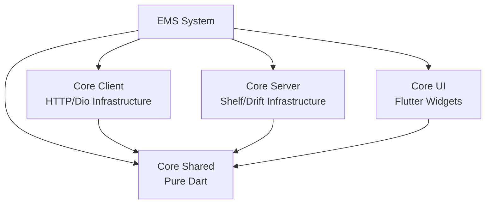

# EduMigSoft Core Feature


O **Core** é a feature fundamental do EMS System (EduMigSoft), fornecendo os blocos de construção essenciais para todo o sistema. Encapsula lógica de domínio compartilhada, componentes arquiteturais base e elementos de UI reutilizáveis utilizados por todas as outras features.

## 📋 Visão Geral

O Core é organizado em uma arquitetura modular e desacoplada, seguindo princípios de **Feature-First + DDD (Domain-Driven Design)**. Cada subpacote tem responsabilidades bem definidas e pode ser utilizado de forma independente.

## 🏗️ Arquitetura



### Subpacotes

| Pacote | Versão | Tipo | Responsabilidade |
|--------|--------|------|------------------|
| **[Core Shared](./core_shared/)** | 1.0.0 | Pure Dart | Entidades de domínio, interfaces, value objects, Result pattern, validadores e utilitários compartilhados |
| **[Core Client](./core_client/)** | 1.0.0 | Dart | Implementações de infraestrutura client-side (HTTP clients com Dio, tratamento de erros, repositórios base) |
| **[Core Server](./core_server/)** | 1.0.0 | Dart | Implementações server-side (Shelf servers, Drift/Postgres database, JWT security, middlewares) |
| **[Core UI](./core_ui/)** | 1.0.0 | Flutter | Componentes de UI reutilizáveis, widgets, MVVM base, navegação, design system |

## ✨ Features Principais

### Core Shared
- ✅ **Result Pattern** para tratamento robusto de erros
- ✅ **Dependency Injection** com GetIt
- ✅ **Validators** e mixins de validação
- ✅ **Exceptions** padronizadas do sistema
- ✅ **Converters** de dados (JSON, Date, etc.)
- ✅ **Logging** estruturado

### Core Client
- ✅ **DioErrorHandler** mixin para tratamento padronizado de erros HTTP
- ✅ **Base Repository** para implementações de repositórios
- ✅ Integração com Result Pattern

### Core Server
- ✅ **Shelf Server** base configurável
- ✅ **Drift ORM** com suporte PostgreSQL
- ✅ **JWT Authentication** e middlewares de segurança
- ✅ **Bcrypt** para hashing de senhas
- ✅ **CORS, Rate Limiting** e outros middlewares
- ✅ **Health Check** endpoints

### Core UI
- ✅ **BaseViewModel** para arquitetura MVVM
- ✅ **Command Pattern** para ações de UI
- ✅ **ResponsiveLayout** para diferentes tamanhos de tela
- ✅ **Navigation** components
- ✅ **FormValidationMixin** para validação de formulários

## 🚀 Instalação

Para utilizar este feature em seu pacote, adicione as dependências apropriadas no `pubspec.yaml`:

```yaml
dependencies:
  # Para lógica de domínio e utilitários
  ems_system_core_shared: ^1.0.0
  
  # Para infraestrutura client-side
  ems_system_core_client: ^1.0.0
  
  # Para componentes de UI (Flutter apps)
  ems_system_core_ui: ^1.0.0
  
  # Para infraestrutura server-side (Backend apps)
  ems_system_core_server: ^1.0.0
```

> [!NOTE]
> Este projeto utiliza **Dart Workspaces**. As dependências são resolvidas automaticamente pelo workspace definido no `pubspec.yaml` raiz.

## 📦 Pré-requisitos

- **Dart SDK**: ^3.10.7
- **Flutter**: >=3.0.0 (apenas para `core_ui`)

## 🛠️ Tecnologias Utilizadas

### Core Shared
- `meta` - Annotations
- `logging` - Logging estruturado
- `zard` - Validação funcional
- `get_it` - Dependency Injection

### Core Client
- `dio` (5.9.0) - HTTP client

### Core Server
- `shelf` (1.4.2) - HTTP server framework
- `drift` (2.30.1) - ORM type-safe
- `postgres` (3.5.9) - PostgreSQL driver
- `dart_jsonwebtoken` (3.3.1) - JWT tokens
- `bcrypt` (1.2.0) - Password hashing

### Core UI
- `flutter` - Framework UI
- `path_provider` - File system paths

## 📚 Documentação

Para informações detalhadas sobre implementação e contribuição, consulte:

- **Subpacotes:**
  - [Core Shared - Documentação](./core_shared/README.md)
  - [Core Client - Documentação](./core_client/README.md)
  - [Core Server - Documentação](./core_server/README.md)
  - [Core UI - Documentação](./core_ui/README.md)

- **Contribuindo:**
  - [CONTRIBUTING.md](./CONTRIBUTING.md)
  - [CHANGELOG.md](./CHANGELOG.md)

## 📄 Licença

Este projeto é proprietário da EduMigSoft. Consulte [LICENSE.md](./LICENSE.md) para mais detalhes.
