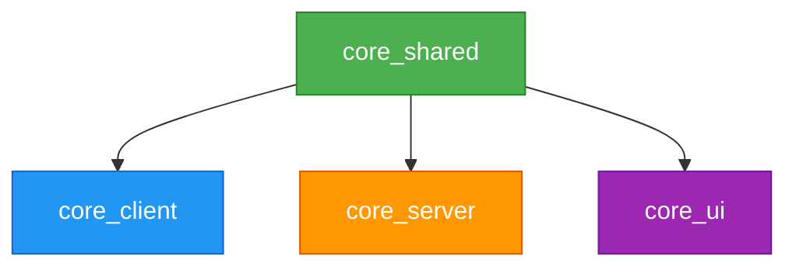

# Relatório de Análise de Arquivos Sem Uso - Pacote Core

**Data da Análise:** 31/01/2026  
**Pacote Analisado:** `@packages/core/`  
**Status:** ✅ Análise Concluída

---

## 📊 Resumo Geral

| Métrica | Valor |
|---------|-------|
| Total de Arquivos .dart | 54 |
| Arquivos em Uso | 54 |
| Arquivos Sem Uso | 0 |
| Classes Sem Uso | 0 |

---

## 🔍 Estrutura do Pacote

O pacote **core** está organizado em 4 sub-pacotes:

### 1. **core_client** (3 arquivos)
- `core_client.dart` - Arquivo principal de exportação
- `src/mixins/dio_error_handler.dart` - Mixin para tratamento de erros Dio
- `src/repositories/base_repository_local.dart` - Classe base para repositórios HTTP

### 2. **core_server** (25 arquivos)
- `core_server.dart` - Arquivo principal de exportação
- Módulos: commons, database, email, middleware, routes, security, servers, utils

### 3. **core_shared** (14 arquivos)
- `core_shared.dart` - Arquivo principal de exportação
- Módulos: commons, converters, dependency_injector, domain, exceptions, messages, result, service, utils, validators

### 4. **core_ui** (12 arquivos)
- `core_ui.dart` - Arquivo principal de exportação
- Módulos: commands, commons, extensions, mixins, navigation, view_models, widgets

---

## ✅ Todos os Arquivos Estão em Uso

### core_client
| Arquivo | Status | Detalhes de Uso |
|---------|--------|-----------------|
| `dio_error_handler.dart` | ✅ Em Uso | Usado pelo `BaseRepositoryLocal` e por repositórios em `school_client`, `user_client` e `notebook_ui` |
| `base_repository_local.dart` | ✅ Em Uso | Estendido por `SchoolRepositoryClient` e `UserRepositoryClient` |

**Referências Encontradas:**
- `DioErrorHandler`: 6 referências no projeto
- `BaseRepositoryLocal`: 3 referências no projeto

### core_server
Todos os 24 arquivos internos são exportados via `core_server.dart` e utilizados extensivamente por:
- Servidores: `ems/server_v1`, `sms/server_v1`
- Pacotes server: `auth_server`, `notebook_server`, `user_server`, `tag_server`, `school_server`

**Observação Importante:**
- ⚠️ `src/email/email_template.dart` **NÃO** está exportado em `core_server.dart`, mas **está em uso** internamente pelo `http_email_service.dart`

**Recomendação:** Considerar exportar `email_template.dart` caso outras partes da aplicação precisem criar templates personalizados de email.

### core_shared
Todos os 13 arquivos internos são exportados via `core_shared.dart` e amplamente utilizados em todo o projeto:
- Apps: `ems/app_v1`, `sms/app_v1`  
- Todos os pacotes client, server e shared do projeto
- Mais de 135 referências a `core_shared` encontradas

**Componentes Principais:**
- `Result` e `Failure` - Sistema de tratamento de erros
- `DependencyInjector` - Injeção de dependências
- `User` e `UserRole` - Entidades de domínio
- `PaginatedResult` - Paginação
- `Validators` - Validações
- `LogService` - Logging

### core_ui
Todos os 11 arquivos internos são exportados via `core_ui.dart` e utilizados pelos módulos UI:
- `auth_ui`, `school_ui`, `user_ui`, `notebook_ui`, `tag_ui`
- Apps principais

**Componentes Principais:**
- `Command` - Padrão de comandos assíncronos
- `BaseCRUDViewModel` - ViewModel base para operações CRUD
- `BasePaginatedCRUDViewModel` - ViewModel base para CRUD paginado
- `BaseNavigationViewModel` - ViewModel base para navegação
- `ResponsiveLayout` - Layout responsivo
- `SecurePageMixin` - Mixin para páginas seguras
- `FormValidationMixin` - Mixin para validação de formulários
- `UserRoleExtension` - Extensões para UserRole
- `AppModule` e `AppNavigationItem` - Sistema de módulos e navegação

**Referências Encontradas:**
- `core_ui`: 20 referências diretas no projeto

---

## 📦 Dependências Entre Pacotes Core

**Observação:** `core_shared` é a base e é importado pelos outros 3 sub-pacotes.

---

## 🎯 Conclusão

✅ **Todos os 54 arquivos do pacote core estão em uso ativo no projeto.**

Não foram identificados:
- ❌ Arquivos sem referências
- ❌ Classes não utilizadas
- ❌ Métodos ou funções obsoletas

### Pontos de Atenção

1. **Email Template Não Exportado**
   - Arquivo: `core_server/lib/src/email/email_template.dart`
   - Status: Em uso internamente, mas não exportado
   - Ação Sugerida: Avaliar se deve ser exportado em `core_server.dart`

2. **Alto Acoplamento**
   - O pacote `core_shared` é uma dependência central de todo o sistema
   - Qualquer mudança em `core_shared` pode impactar todo o projeto

3. **Boa Organização**
   - Os 4 sub-pacotes seguem uma separação clara de responsabilidades:
     - `core_client` - Cliente HTTP
     - `core_server` - Servidor e infraestrutura
     - `core_shared` - Código compartilhado
     - `core_ui` - UI e ViewModels

---

## 📈 Estatísticas de Uso

| Componente | Referências Aproximadas |
|------------|------------------------|
| core_shared | 135+ |
| core_ui | 20+ |
| core_server | 35+ |
| core_client | 6+ |
| DioErrorHandler | 6 |
| BaseRepositoryLocal | 3 |
| EmailTemplate | 2 (interno) |

---

## ✨ Recomendações

1. ✅ **Manter todos os arquivos** - Nenhum arquivo deve ser removido
2. 💡 **Considerar exportar** `email_template.dart` em `core_server.dart` para uso externo
3. 📚 **Documentar** as dependências entre os sub-pacotes do core
4. 🧪 **Adicionar testes** para componentes críticos como `DioErrorHandler` e `BaseRepositoryLocal`

---

**Gerado automaticamente em:** 31/01/2026 às 09:15  
**Ferramenta:** Antigravity Analysis Tool
