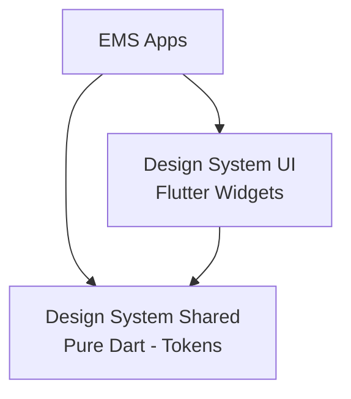

# Design System Feature


O **Design System** fornece componentes visuais padronizados, tokens de design e sistema de temas para garantir consistência visual em todos os aplicativos do EMS System.

## 📋 Visão Geral

Este pacote centraliza a identidade visual da plataforma, incluindo cores, tipografia, espaçamentos, componentes de UI reutilizáveis e padrões de design que devem ser seguidos em todo o sistema.

## 🏗️ Arquitetura



### Subpacotes

| Pacote | Versão | Tipo | Status | Responsabilidade |
|--------|--------|------|--------|------------------|
| **design_system_shared** | 1.0.0 | Pure Dart | 🟡 Em desenvolvimento | Tokens de design (cores, tipografia, espaçamentos) |
| **design_system_ui** | 1.0.0 | Flutter | 🟡 Em desenvolvimento | Componentes Flutter reutilizáveis |

> [!NOTE]
> Os pacotes `design_system_client` e `design_system_server` estão comentados no workspace, pois não há necessidade atual de infraestrutura client/server específica para o design system.

## ✨ Features Planejadas

### Design System Shared
- 🟡 **Tokens de Cores** - Paleta de cores primárias, secundárias, feedback
- 🟡 **Tokens de Tipografia** - Escalas de fontes, pesos, line heights
- 🟡 **Tokens de Espaçamento** - Grid system padronizado
- 🟡 **Tokens de Bordas** - Border radius, border width
- 🟡 **Temas** - Light theme e dark theme
- 🟡 **Breakpoints** - Responsividade (mobile, tablet, desktop)

### Design System UI
- 🟡 **Buttons** - Primary, secondary, outline, text, icon buttons
- 🟡 **Cards** - DSCard e variantes
- 🟡 **Inputs** - Text fields, dropdowns, checkboxes, radio buttons
- 🟡 **Typography** - Heading, body, caption, label components
- 🟡 **Icons** - Biblioteca de ícones padronizados
- 🟡 **Layouts** - Grid, stack, container components
- 🟡 **Navigation** - App bars, bottom nav, side nav, tabs
- 🟡 **Feedback** - Alerts, snackbars, dialogs, loading indicators

**Legenda:** ✅ Implementado | 🟡 Em desenvolvimento | 🔴 Planejado

## 🚀 Instalação

```yaml
dependencies:
  # Tokens de design
  design_system_shared: ^1.0.0
  
  # Componentes Flutter
  design_system_ui: ^1.0.0
```

> [!NOTE]
> Este projeto utiliza **Dart Workspaces**. As dependências são resolvidas automaticamente.

## 📖 Uso Planejado

### Tokens de Design

```dart
import 'package:design_system_shared/design_system_shared.dart';

// Cores
final primaryColor = DSColors.primary;
final accentColor = DSColors.accent;

// Tipografia
final headingStyle = DSTypography.h1;
final bodyStyle = DSTypography.body;

// Espaçamentos
final spacing = DSSpacing.md; // 16px
final paddingLarge = DSSpacing.lg; // 24px
```

### Componentes UI

```dart
import 'package:design_system_ui/design_system_ui.dart';

// Botão primário
DSButton.primary(
  label: 'Salvar',
  onPressed: () => save(),
);

// Card
DSCard(
  child: Text('Conteúdo do card'),
);

// Input
DSTextField(
  label: 'Email',
  hint: 'Digite seu email',
  onChanged: (value) => setState(() => email = value),
);
```

## 🎨 Princípios de Design

### Consistência
Todos os componentes seguem as mesmas convenções visuais e comportamentais.

### Acessibilidade
- Contraste mínimo WCAG AA (4.5:1 para texto)
- Suporte a leitores de tela
- Navegação por teclado
- Tamanhos de toque adequados (min 44x44)

### Responsividade
Componentes adaptam-se a diferentes tamanhos de tela (mobile, tablet, desktop).

### Modularidade
Componentes pequenos e focados, facilmente combináveis.

## 🛠️ Tecnologias Utilizadas

### Design System Shared
- `meta` - Annotations
- Design tokens em Pure Dart

### Design System UI
- `flutter` - Framework UI
- `core_ui` - Base para componentes
- Design tokens do `design_system_shared`

## 📚 Documentação

- [Design System Shared - Documentação](./design_system_shared/README.md)
- [Design System UI - Documentação](./design_system_ui/README.md)
- [CHANGELOG.md](./CHANGELOG.md)

## 🔮 Roadmap

- [ ] Definir paleta de cores completa
- [ ] Implementar tokens de tipografia
- [ ] Criar sistema de espaçamento
- [ ] Desenvolver componentes básicos (Button, Card, Input)
- [ ] Implementar componentes de navegação
- [ ] Adicionar suporte a temas (light/dark)
- [ ] Documentar guidelines de uso
- [ ] Criar storybook/galeria de componentes
- [ ] Implementar animações e transições padronizadas

## 📄 Licença

Este projeto está licenciado sob a licença MIT. Consulte [LICENSE.md](./LICENSE.md) para mais detalhes.
