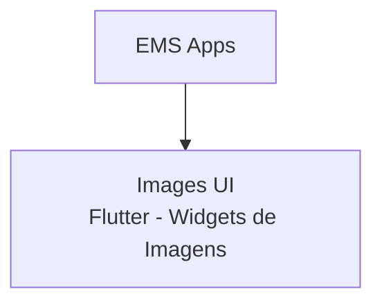

# Images Feature


O **Images** fornece componentes e utilitários para gestão e exibição de imagens no EMS System, incluindo caching, otimização e widgets especializados.

## 📋 Visão Geral

Este pacote centraliza a lógica de manipulação de imagens, oferecendo componentes Flutter otimizados para exibição, carregamento e cache de imagens locais e remotas.

## 🏗️ Arquitetura



### Subpacotes

| Pacote | Versão | Tipo | Status | Responsabilidade |
|--------|--------|------|--------|------------------|
| **images_ui** | 1.0.0 | Flutter | 🟡 Em desenvolvimento | Widgets e componentes para exibição de imagens |

> [!NOTE]
> Os pacotes `images_shared`, `images_client` e `images_server` não estão ativos. A gestão de imagens atualmente é focada apenas na camada de UI.

## ✨ Features Planejadas

### Images UI
- 🟡 **ImageViewer** - Widget para exibição de imagens com zoom
- 🟡 **CachedImage** - Imagens com cache automático
- 🟡 **ImagePicker** - Seletor de imagens (galeria/câmera)
- 🟡 **ImageCropper** - Recorte e edição de imagens
- 🟡 **Placeholder** - Estados de loading e erro
- 🟡 **AvatarImage** - Componente especializado para avatares
- 🟡 **ImageGallery** - Galeria de imagens com navegação
- 🟡 **OptimizedImage** - Otimização automática de tamanho/qualidade

**Legenda:** ✅ Implementado | 🟡 Em desenvolvimento | 🔴 Planejado

## 🚀 Instalação

```yaml
dependencies:
  images_ui: ^1.0.0
```

> [!NOTE]
> Este projeto utiliza **Dart Workspaces**. As dependências são resolvidas automaticamente.

## 📖 Uso Planejado

### Imagem com Cache

```dart
import 'package:images_ui/images_ui.dart';

CachedImage(
  url: 'https://example.com/image.jpg',
  placeholder: CircularProgressIndicator(),
  errorWidget: Icon(Icons.error),
);
```

### Seletor de Imagens

```dart
final ImagePicker picker = ImagePicker();

ElevatedButton(
  onPressed: () async {
    final image = await picker.pickImage(source: ImageSource.gallery);
    if (image != null) {
      setState(() => selectedImage = image);
    }
  },
  child: Text('Selecionar Imagem'),
);
```

### Avatar com Fallback

```dart
AvatarImage(
  url: user.avatarUrl,
  fallback: Text(user.initials),
  size: 48,
);
```

## 🎨 Funcionalidades

### Cache Inteligente
- Cache em disco e memória
- Limpeza automática de cache antigo
- Pré-carregamento de imagens

### Otimização
- Redimensionamento automático
- Compressão de qualidade
- Lazy loading

### Estados de Carregamento
- Placeholder customizável
- Indicador de progresso
- Tratamento de erros

## 🛠️ Tecnologias Utilizadas

### Images UI
- `flutter` - Framework UI
- `cached_network_image` (planejado) - Cache de imagens remotas
- `image_picker` (planejado) - Seleção de imagens
- `image_cropper` (planejado) - Edição de imagens

## 📚 Documentação

- [Images UI - Documentação](./images_ui/README.md)
- [CHANGELOG.md](./CHANGELOG.md)

## 🔮 Roadmap

- [ ] Implementar CachedImage widget
- [ ] Adicionar ImagePicker para seleção de imagens
- [ ] Criar AvatarImage component
- [ ] Implementar ImageCropper
- [ ] Adicionar ImageGallery com navegação
- [ ] Otimização automática de imagens
- [ ] Suporte a diferentes formatos (JPEG, PNG, WEBP, SVG)
- [ ] Tratamento de erros e fallbacks
- [ ] Performance profiling e otimização

## 📄 Licença

Este projeto está licenciado sob a licença MIT. Consulte [LICENSE.md](./LICENSE.md) para mais detalhes.
