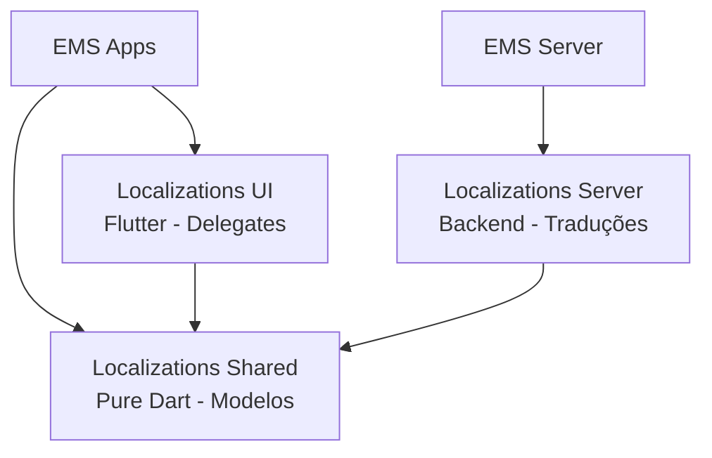

# Localizations Feature


O **Localizations** fornece infraestrutura de internacionalização (i18n) para o EMS System, permitindo suporte a múltiplos idiomas e localidades.

## 📋 Visão Geral

Este pacote centraliza traduções e formatações específicas de localidade (datas, números, moedas) que são compartilhadas entre diferentes aplicativos do sistema (EMS, futuro SMS, etc.).

> [!IMPORTANT]
> **Estratégia de Localização Multi-Sistema**
> 
> Para evitar duplicidade e excesso de traduções:
> - `localizations` - Traduções **comuns** compartilhadas entre todos os sistemas
> - `localizations_ems` (futuro) - Traduções **específicas** do EMS System
> - `localizations_sms` (futuro) - Traduções **específicas** do SMS System

## 🏗️ Arquitetura



### Subpacotes

| Pacote | Versão | Tipo | Status | Responsabilidade |
|--------|--------|------|--------|------------------|
| **localizations_shared** | 1.0.0 | Pure Dart | 🟡 Em desenvolvimento | Modelos de localização e interfaces |
| **localizations_server** | 1.0.0 | Dart | 🟡 Em desenvolvimento | Gerenciamento de traduções no backend |
| **localizations_ui** | 1.0.0 | Flutter | 🟡 Em desenvolvimento | Delegates e widgets localizados |

> [!NOTE]
> O pacote `localizations_client` não está ativo, pois as traduções são tipicamente carregadas diretamente nos apps sem necessidade de cliente HTTP específico.

## ✨ Features Planejadas

### Localizations Shared
- 🟡 **Locale Models** - Modelos de idiomas suportados
- 🟡 **Translation Keys** - Chaves de tradução padronizadas
- 🟡 **Formatters** - Utilitários para formatação de datas, números

### Localizations Server
- 🟡 **Translation Management** - CRUD de traduções
- 🟡 **API Endpoints** - Endpoints para buscar traduções
- 🟡 **Version Control** - Controle de versão de traduções
- 🟡 **Export/Import** - Exportar/importar traduções (JSON, CSV)

### Localizations UI
- 🟡 **LocalizationDelegate** - Delegate do Flutter para i18n
- 🟡 **LocalizedText** - Widget para textos localizados
- 🟡 **LanguageSwitcher** - Seletor de idioma
- 🟡 **DateFormatter** - Formatação de datas
- 🟡 **NumberFormatter** - Formatação de números e moedas

**Legenda:** ✅ Implementado | 🟡 Em desenvolvimento | 🔴 Planejado

## 🌍 Idiomas Suportados (Planejado)

- 🇧🇷 Português (Brasil) - pt_BR (padrão)
- 🇺🇸 Inglês (EUA) - en_US
- 🇪🇸 Espanhol - es_ES
- 🇫🇷 Francês - fr_FR

## 🚀 Instalação

```yaml
dependencies:
  # Para apps Flutter
  localizations_shared: ^1.0.0
  localizations_ui: ^1.0.0
  
  # Para backend
  localizations_shared: ^1.0.0
  localizations_server: ^1.0.0
```

> [!NOTE]
> Este projeto utiliza **Dart Workspaces**. As dependências são resolvidas automaticamente.

## 📖 Uso Planejado

### Configurar Localização no App

```dart
import 'package:flutter_localizations/flutter_localizations.dart';
import 'package:localizations_ui/localizations_ui.dart';

MaterialApp(
  localizationsDelegates: [
    AppLocalizations.delegate,
    GlobalMaterialLocalizations.delegate,
    GlobalWidgetsLocalizations.delegate,
    GlobalCupertinoLocalizations.delegate,
  ],
  supportedLocales: [
    Locale('pt', 'BR'),
    Locale('en', 'US'),
    Locale('es', 'ES'),
  ],
  locale: Locale('pt', 'BR'),
  //...
);
```

### Usar Traduções

```dart
import 'package:localizations_ui/localizations_ui.dart';

// Texto localizado
Text(AppLocalizations.of(context).welcomeMessage);

// Plurais
Text(AppLocalizations.of(context).itemCount(5)); // "5 itens"

// Interpolação
Text(AppLocalizations.of(context).greeting(userName)); // "Olá, João!"
```

### Formatação de Datas e Números

```dart
import 'package:localizations_shared/localizations_shared.dart';

// Data
final formattedDate = DateFormatter.format(
  DateTime.now(),
  locale: 'pt_BR',
); // "19 de janeiro de 2026"

// Moeda
final formattedCurrency = CurrencyFormatter.format(
  1500.50,
  locale: 'pt_BR',
); // "R$ 1.500,50"

// Número
final formattedNumber = NumberFormatter.format(
  123456.789,
  locale: 'pt_BR',
); // "123.456,789"
```

### Trocar Idioma Dinamicamente

```dart
LocalizationService.changeLocale(Locale('en', 'US'));
```

## 🛠️ Tecnologias Utilizadas

### Localizations Shared
- `intl` (planejado) - Internacionalização e formatação

### Localizations Server
- `drift` (planejado) - Armazenamento de traduções
- `shelf` - API endpoints

### Localizations UI
- `flutter` - Framework UI
- `flutter_localizations` - Delegates do Flutter
- `intl` (planejado) - Formatação client-side

## 📚 Documentação

- [Localizations Shared - Documentação](./localizations_shared/README.md)
- [Localizations Server - Documentação](./localizations_server/README.md)
- [Localizations UI - Documentação](./localizations_ui/README.md)
- [CHANGELOG.md](./CHANGELOG.md)

## 🔮 Roadmap

- [ ] Definir estrutura de chaves de tradução
- [ ] Implementar LocalizationDelegate para Flutter
- [ ] Criar formatadores de data, número e moeda
- [ ] Adicionar suporte a pt_BR (padrão)
- [ ] Adicionar suporte a en_US
- [ ] Implementar backend para gestão de traduções
- [ ] Criar interface administrativa para edição de traduções
- [ ] Exportar/importar traduções (JSON, CSV, ARB)
- [ ] Suporte a RTL (Right-to-Left) para árabe, hebraico
- [ ] Cache de traduções
- [ ] Fallback automático para idioma padrão

## 📋 Estrutura de Traduções (Planejado)

```json
{
  "common": {
    "welcome": "Bem-vindo",
    "save": "Salvar",
    "cancel": "Cancelar",
    "delete": "Excluir",
    "edit": "Editar"
  },
  "auth": {
    "login": "Entrar",
    "logout": "Sair",
    "register": "Registrar",
    "forgotPassword": "Esqueceu a senha?"
  },
  "user": {
    "profile": "Perfil",
    "settings": "Configurações",
    "editProfile": "Editar Perfil"
  }
}
```

## 📄 Licença

Este projeto está licenciado sob a licença MIT. Consulte [LICENSE.md](./LICENSE.md) para mais detalhes.
