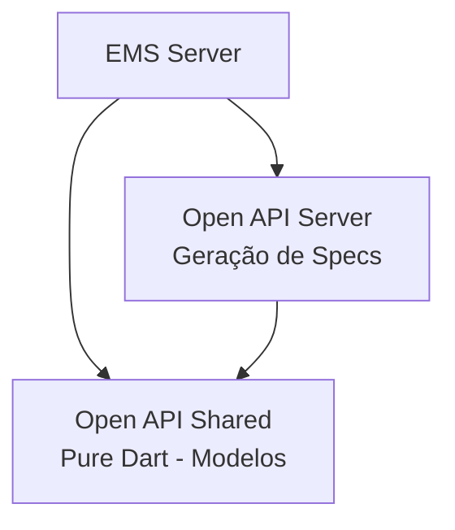

# Open API Feature


O **Open API** fornece especificações OpenAPI (Swagger) para documentar e padronizar as APIs REST do EMS System, facilitando integração, teste e consumo por clientes externos.

## 📋 Visão Geral

Este pacote gerencia as especificações OpenAPI/Swagger das APIs do sistema, permitindo documentação automática, validação de contratos e geração de clientes em várias linguagens.

## 🏗️ Arquitetura



### Subpacotes

| Pacote | Versão | Tipo | Status | Responsabilidade |
|--------|--------|------|--------|------------------|
| **open_api_shared** | 1.0.0 | Pure Dart | 🟡 Em desenvolvimento | Modelos e anotações OpenAPI |
| **open_api_server** | 1.0.0 | Dart | 🟡 Em desenvolvimento | Geração de specs, endpoints de documentação |

> [!NOTE]
> Os pacotes `open_api_client` e `open_api_ui` não estão ativos. O foco atual é documentar as APIs do servidor.

## ✨ Features Planejadas

### Open API Shared
- 🟡 **Annotations** - Anotações para documentar endpoints
- 🟡 **Schema Models** - Modelos de schema OpenAPI
- 🟡 **Spec Builder** - Construtor de especificações

### Open API Server
- 🟡 **Spec Generator** - Geração automática de specs OpenAPI 3.0
- 🟡 **Swagger UI** - Interface visual da documentação
- 🟡 **Redoc** - Documentação alternativa com Redoc
- 🟡 **Validation** - Validação de requests contra spec
- 🟡 **Export** - Exportar specs (JSON, YAML)
- 🟡 **Versioning** - Suporte a versionamento de API

**Legenda:** ✅ Implementado | 🟡 Em desenvolvimento | 🔴 Planejado

## 🚀 Instalação

```yaml
dependencies:
  # Para backend
  open_api_shared: ^1.0.0
  open_api_server: ^1.0.0
```

> [!NOTE]
> Este projeto utiliza **Dart Workspaces**. As dependências são resolvidas automaticamente.

## 📖 Uso Planejado

### Documentar Endpoint com Anotações

```dart
import 'package:open_api_server/open_api_server.dart';

@OpenApi(
  summary: 'Login de usuário',
  description: 'Autentica um usuário com email e senha',
  tags: ['Auth'],
)
@RequestBody(LoginRequest)
@Response(200, 'Login bem-sucedido', UserDetails)
@Response(401, 'Credenciais inválidas', ErrorResponse)
Response _loginHandler(Request request) {
  // ...
}
```

### Gerar Especificação

```dart
final spec = OpenApiGenerator.generate(
  title: 'EMS System API',
  version: '1.0.0',
  description: 'API para gestão do EMS System',
  servers: [
    Server(url: 'https://api.edumigsoft.com/v1'),
  ],
);

// Exportar para JSON
final json = spec.toJson();
File('openapi.json').writeAsStringSync(jsonEncode(json));
```

### Servir Swagger UI

```dart
router.get('/docs', swaggerUIHandler);
router.get('/openapi.json', openApiSpecHandler);
```

Acessar em: `http://localhost:8080/docs`

## 📚 Exemplo de Spec Gerada

```yaml
openapi: 3.0.0
info:
  title: EMS System API
  version: 1.0.0
  description: API para gestão do EMS System
servers:
  - url: https://api.edumigsoft.com/v1
    description: Servidor de produção

paths:
  /auth/login:
    post:
      summary: Login de usuário
      tags:
        - Auth
      requestBody:
        required: true
        content:
          application/json:
            schema:
              $ref: '#/components/schemas/LoginRequest'
      responses:
        '200':
          description: Login bem-sucedido
          content:
            application/json:
              schema:
                $ref: '#/components/schemas/UserDetails'
        '401':
          description: Credenciais inválidas
          content:
            application/json:
              schema:
                $ref: '#/components/schemas/ErrorResponse'

components:
  schemas:
    LoginRequest:
      type: object
      required:
        - email
        - password
      properties:
        email:
          type: string
          format: email
        password:
          type: string
          format: password
```

## 🛠️ Tecnologias Utilizadas

### Open API Shared
- `meta` - Annotations
- OpenAPI models

### Open API Server
- `shelf` - Servir spec e Swagger UI
- `openapi_spec` (planejado) - Geração de specs

## 📚 Documentação

- [Open API Shared - Documentação](./open_api_shared/README.md)
- [Open API Server - Documentação](./open_api_server/README.md)
- [CHANGELOG.md](./CHANGELOG.md)

## 🔮 Roadmap

- [ ] Definir anotações para documentação de endpoints
- [ ] Implementar gerador de especificação OpenAPI 3.0
- [ ] Integrar Swagger UI para visualização
- [ ] Adicionar validação de requests contra spec
- [ ] Suporte a autenticação (Bearer token) na spec
- [ ] Documentar todos os endpoints de Auth
- [ ] Documentar todos os endpoints de User
- [ ] Exportar specs em JSON e YAML
- [ ] Gerar clientes automaticamente (Dart, JS, Python)
- [ ] Versionamento de API (v1, v2, etc.)
- [ ] Testes de contrato baseados na spec
- [ ] Documentação de webhooks e eventos

## 🌐 Endpoints de Documentação (Planejados)

| Endpoint | Descrição |
|----------|-----------|
| `GET /docs` | Interface Swagger UI |
| `GET /redoc` | Interface Redoc |
| `GET /openapi.json` | Especificação OpenAPI em JSON |
| `GET /openapi.yaml` | Especificação OpenAPI em YAML |

## 📋 Benefícios

### Para Desenvolvedores
- **Documentação Automática** - Mantida sempre atualizada
- **Validação** - Contratos garantidos entre cliente e servidor
- **Testes** - Facilita criação de testes de contrato
- **IDE Support** - Autocomplete em clientes gerados

### Para Integrações
- **Contratos Claros** - Especificação padronizada
- **Client Generation** - Gerar clientes em várias linguagens
- **Discovery** - Fácil exploração da API
- **Versionamento** - Controle de mudanças

## 📄 Licença

Este projeto está licenciado sob a licença MIT. Consulte [LICENSE.md](./LICENSE.md) para mais detalhes.
